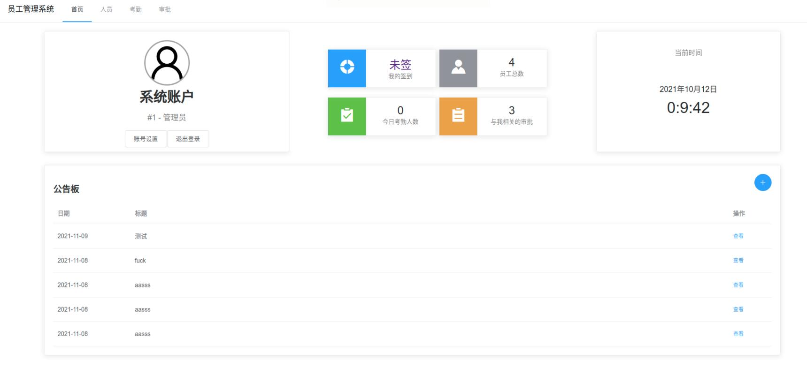

# 员工管理系统

## 摘要

随着互联网与计算技术的普及，中小企业对于利用计算机技术处理员工信息的需求日益增生，为此需要结合较新的技术栈与这些公司和企业实际情况，实现符合它们实际需要的员工管理系统。文中对公里司管理员工的实际情况进行了合理分析和科学论证，设计了以SpringBoot为主的员工管理系统。员工管理系统主体采用传统B/S模式，对Web端的主要交互及结构进行了设计和规划，对后端部分的数据处理、应答响应等功能做了架构布局与合理分析。其中后端主要采用SpringBoot结合MySQL的方式实现核心功能，前段采用Vue作为响应式框架基础。最后使用主流浏览器在Linux平台下测试，效果良好。文中设计的系统能够有效存储公司员工的基础信息，可实现员工信息的基本管理功能，并能根据企业提出的具体管理需求实现相应的管理功能，因此对于实际应用具有一定的应用价值与社会价值。

**关键词**：员工管理；企业管理；SpringBoot；B/S；MySQL；Vue；响应式框架

## 一、架构模式

### 1.1 整体架构

系统采用以Nginx部署静态文件和前端文件和综合前后端的运行模式。Nginx提供了对前端和后端的综合支持，同时解决了网站整体的跨域问题。


图1.1.1 整体架构概览示意图


得益于该结构，在后续可以根据需要，部署多个后端，使用Nginx设置qos以实现基本的多后端负载均衡效果。同时可以实现后期对前端资源的CDN部署。

后端部分需要MySQL提供数据存储支持。

如果有需要，可以通过配置后端的方式引入对Redis的支持。

### 1.2 前端架构

前端部分采用了以Vue为主，以Element-UI为布局和组件库的响应式框架。

在数据层面，前端使用Vue.js实现了网页主题功能的动态加载，使用了Vuex实现了在全局数据共享交互，同时辅以VuePersistence插件实现了对接用户浏览器端LocalStorage，借助SpringBoot的Session机制，实现对数据的持久化保存。

在前后端交互层面，前端使用了axios实现数据的基本GET和POST操作，实现数据在前后端的上传下达。在部分界面手动实现了简易的动态获取机制和简易的数据上传队列机制，使得在这些界面上的数据能够按照优先级有序更新。

在资源加载层面，前端预留了CDN支持，对部分非必要静态图片资源使用了data标签直接存储图片base64数据的方法，并依据本方法配置了Vue-cli的部分Webpack插件，实现对该部分图片的迅速加载的效果，例如登录界面背景图和部分不影响视觉体验的图片素材。


图1.1.2 前端数据层面概览示意图

### 1.3 后端架构

后端使用SpringBoot布局，整体以提供Restful风格的RestController为主，为前端提供后端API。

后端部分的部署以Nginx为主，Nginx实现了前端和后端的分离和多后端的负载均衡支持。Nginx将后端映射反向代理至对外端口的`/api/`下，例如：

映射前：`http://backend-service/testAPI `
映射后：`http://service-outside/api/testAPI`

此方案同时可以解决浏览器的跨域问题，使得前端和后端在分离的同时仍在同一个域内，便于数据的传递和共享。

后端与数据库的交互使用了Mybatis，通过对xml文件、Java Interface和对应的Java Class的相互映射，实现对数据库的存取交互。

## 二、使用

### 2.1 系统基本情况

在本系统中，账号分为员工账号、部门分管账号和管理员账号。其中管理员账号、部门分管账号需要手动在数据库内添加，员工账号可以由管理员账号或部门分管账号在网站创建。

管理员账号具有处理所有类型审批的功能和部门分管账号的所有功能，员工账号具有签到和修改密码的功能。

### 2.2 系统部署

需要保证系统配置完毕了MySQL 5.7和Nginx。

将附件文件解压缩，分别有SQL、Main、Web三个文件夹。

#### 2.2.1 数据库初始化

创建staffmanager数据库，并利用SQL文件夹下的sql文件初始化数据库。

t_users表中可以按照给出的test用户，创建若干管理员账号。role表示用户角色，角色对应关系为：

角色 (role) | 权限
-|-
0 | 管理员
1 | 部门分管账号
2 | 员工账号

密码可使用 `0d2ac296f1c85ef93cc185385de2c413f0054627` ，表示`1234567`。

### 2.2.2 配置Nginx

对nginx配置，可参考下面的文件配置前后端关系。

```
server {
	listen 8089 default_server;
	listen [::]:8089 default_server;
	root /var/www/html;
	index index.html index.htm index.nginx-debian.html;
        proxy_set_header Cookie $http_cookie;
        proxy_set_header X-Forwarded-Host $host;
        proxy_set_header X-Forwarded-Server $host;
        proxy_set_header X-Forwarded-For $proxy_add_x_forwarded_for;
	location /api/ {
		proxy_pass http://127.0.0.1:7081/;
	}
}
```

此处将前端文件指定到了 `/var/www/html` 文件夹（以Linux为示例），需要依据具体情况判断。

#### 2.2.3 后端配置

在Main文件夹中有一个jar文件。使用压缩软件，打开并修改`application.yml`文件，将其中的数据库信息配置为正确的信息。

配置完毕后，使用`java -jar serverMain.jar` 指令，直接运行该jar文件。

注：不需要考虑配置tomcat，后端必要的依赖在jar包中均已自带。

### 2.3 登录账户


进入管理系统页面，在如上界面中，输入用户名和密码，点击登录按钮。



登录成功后，即可看到主页面。

### 2.4 员工管理

在员工页面内，可以查看到所有员工的员工列表。


在该列表上方，可以点击排序方式，对员工做排序处理。在输入框内可输入部门名称或姓名，对员工搜索。

点击 查看 按钮可查看员工详细信息。


在详细信息页面，点击 编辑 按钮可以修改员工的基本信息，使用工资计算工具可以计算员工的工资信息，使用员工晋升工具可以设置员工的晋升情况。

### 2.5 考勤

员工的考勤时长需要其自己登录账户签到。签到入口可以在考勤页面或主页面，点击 我的签到 标签卡，例如：


点击后即可跳转至签到页面。


在签到页面点击 立即签到 即可签到，在退班时需要点击 签退 按钮以表示离岗，系统将自动计算本日其考勤总时长。

### 2.6 审批

在审批页面，可以通过筛选工具搜索相关审批材料。  
在创建页面，可以填写信息创建审批，点击提交按钮即可提交。


点击审批的 查看 按钮即可查看该审批的详情。


如果该审批已经被回复，则会被标记为已解决，同时显示回复信息。如果未被回复，有权限的用户将会显示出回复框，可以输入完毕回复内容点击提交按钮提交回复。

## 三、功能实现

### 3.1 用户登录

登录在后端部分在AccountController处实现了对外交互逻辑，在AccountServiceImpl里实现了内部处理逻辑，在LoginInterceptor实现了对未登录情况的拦截。用户登录时，通过Springboot的Session机制存储了用户登录的用户对象，以此实现登录状态在后端的保存。例如在AccountController.login方法中此处实现：
request.getSession().setAttribute("login", user);
前端部分，在Vue Router的配置里，每次切换页面时都会检查后端接口，使前后端的登录状态同步一致。例如Store/index.js中此处实现：
this.$axios.get("/api/account/checkLogin", {}).then((data) => {
        if (data.data === false) {
          commit("userStatus", false);
          localStorage.removeItem("loginFlag");
        } else commit("userData", data.data);
      });
同时前端使用了router.beforeEach这一Vue Router API实现拦截。每个页面都有一个叫做isLogin的meta属性，来控制本页面是否能在非登录状态下访问。此拦截逻辑可以在main.js和router/index.js中查阅。
3.2 签到
签到功能分为两个表存储，分别存储员工的单次签到信息和以月度为单位的员工月度签到总信息。
内部实现时，由前端发送签到请求，前端逻辑示例如下：
this.$axios.post("/api/attend/submit/attend")
        .then(data => {
          if (data.data === true) {
            this.$message.success("签到成功");
            this.checkAttend();
          } else {
            this.$message.error("签到失败");
          }
        });
该请求发送至后端，后端分析处理，以服务器时间为准补齐时间戳等信息，提交至数据库内。
@Override
    public void attendCheck(int staffId, boolean type) {
        attendCheckMapper.pushAttendCheck(staffId, new Date(), type);
        if (!type)
            pushStaffTime(staffId, getTodayAttendTime(staffId));
    }
签到询问同理，前端逻辑在/views/attend/中，后端逻辑在AttendService中。
3.3 审批
员工提交审批可以通过审批增加页面提交。审批的实现和公告板基本同理。
前端审批部分代码处理是一个对表单数据的POST，发送至后端API。例如：
onSubmit() {
      this.$axios.post("/api/order/create", {
        title: this.boardForm.title,
        targetDepartment: this.boardForm.targetDepartment,
        description: this.boardForm.description
      }).then(data => {
        if (data.data === true) 
          this.$message.success("创建成功！");
      })
    }
后端处理时会简单判断数据，然后保存至数据库内。
    public OrderUnit createOrder() {
        OrderUnit order = new OrderUnit(new Date(new Date().getTime()), author.getId(), targetDepartment, title, details);
        orderMapper.addOrder(order);
        return order;
 }
3.4 员工管理
员工的排序操作等基本的处理逻辑基本在前端实现。
用户在搜索框内键入搜索信息，会动态调用该js函数，实现动态获取。
refreshStaffList() {
      this.$axios.get("/api/staff/getAllStaff")
        .then(data => {
          if (data == null || data.data == null || data.data == "") {
            this.staffList = [];
          } else {
            this.staffList = data.data;
            // 关键字搜索
            if (this.keywords !== "") {
              this.staffList = this.staffList.filter(x => {
                return x.realName.indexOf(this.keywords) >= 0 ||
                  x.department.indexOf(this.keywords) >= 0 ||
                  x.job.indexOf(this.keywords) >= 0 ||
                  x.username.indexOf(this.keywords) >= 0;
              });
            }
            //按预期工资排序
            if(this.sortType==2){
              this.staffList = this.staffList.sort((a,b)=>{
                return b.expectSalary - a.expectSalary;
              })
            }
            //按加班时间排序
            if(this.sortType==3){
              this.staffList = this.staffList.sort((a,b)=>{
                return b.extraSec - a.extraSec;
              })
              console.log(this.staffList);
            }
          }
        });
    }
搜索的主要逻辑通过此处的排序算法和简单的关键字匹配实现。后端对此处数据会有简易的缓存机制。二者相互配合，实现了员工信息的基本的筛选、排序和呈现。

## 四、总结

在本课设作业中，我主要采用了目前较为新颖的技术栈进行实现，通过前后端分离的设计总体架构设计出整套系统，并且运行较为完好，完整的实现了本次课设作业要求的各项任务。

### 4.1 研究重点

本作业主要研究的是：

1. 研究实际的项目是如何部署开发工作的；
2. 研究前后端分离的项目是如何实现并工作的；
3. 研究Vue等响应式框架是如何使用的；
4. 研究Springboot为主题的项目是如何开发的。

本课设作业已经完成如上研究方面，经过实际应用，目前该系统的开发已经基本完成所对应需求。

### 4.2 不足与展望

本课设作业中对具体的权限权籍调度机制没有做到更进一步的完善，并限于实际的开发时长，各个功能没能更进一步开发，目前各个系统只是停留在初期的演示测试阶段。对Springboot和Vue的更多特性没有做到应有的发挥。

这次的课程设计让我明白了许多，同时也发现了自身的不足点。我开始明白课程设计不仅是对以前所学知识的一种全面总结及综合应用，也是对自身能力的一种提高。
