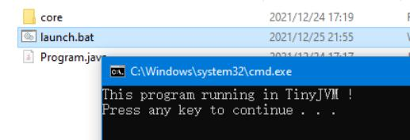

# 基于Java平台的简易JVM的设计与实现

## 摘要

随着教学场景的需要以及计算机软件技术的日益发展，针对计算机软件开发领域最基础、最核心的部分的探究显得尤为重要。同时对于部分程序代码数据的在线评测系统的开发迭代而言，针对某一语言的运作逻辑的精准控制的需求不断增加，为此需要针对这些领域做更加细致化的探索。文中以Java语言运行所依赖的Java虚拟机为例，探究Java虚拟机的基础运作原理，并依此作为基础，对Java软件运行机制做更加细致的分析，以此来设计研究更加深入的运行机理，并为此设计并编写了一套使用Java语言模拟的Java虚拟机用作实验。文中以最基础的Java程序的Hello World的具体运作机理作为实例，在OpenJDK 1.8的测试环境下，通过模拟的Java虚拟机对软件代码的运行实验，效果良好。文中设计的Java虚拟机可以实现最为基础的Java二进制文件的运行功能，具有一定学习意义和一定范围内场景的应用价值。

**关键词**：Java；面向对象；运行原理；Java虚拟机；JVM；二进制文件；字节码

## 第一章 绪论

### 1.1 研究背景

Java虚拟机是Java程序代码文件经过编译处理后所得的二进制文件的最终运行环境，它起到了将Java逻辑与具体运行环境隔绝的作用，是Java代码“一次编译、到处运行”这一特性的具体实施基础。

随着教学场景对Java重视程度与日俱增，传统的代码评测系统（即一种将学生代码提交至系统中，由系统后台自动编译并与标准答案依照一定算法自动比对，以此自动判断学生代码是否正确的教学系统）对Java语言的支持仅停留在创建虚拟环境，通过加以某些虚拟机限定参数来达到限制代码安全性的目的，对于代码底层的运行逻辑无法做到类似C语言和C++代码那样的精准控制。同时，Java底层的运行逻辑对认识面向对象语言而言也有一定的教学意义。所以进一步了解Java虚拟机运行原理尤为重要。

### 1.2 国内外研究现状

由于Sun公司对于Java虚拟机的实现制定了一些具体且详尽的实施规则，这使得国内外对Java虚拟机的实现和学习具有一定统一、完善、详细、权威且易于复现的方式。

相关的研究资料、产品和项目在国内外开源社区中屡见不鲜，但是针对基础程度的分析和探究而言，有关内容还相对较少。

### 1.3 实验研究重点和思路

因此对于本文而言，本文将主要聚焦于具体的运作逻辑，在具体的研究成果的基础之上，对已有内容加以运用，同时加以独创的设计和说明方式，来进一步探索诸如最基本的Hello World程序是如何运行的。

### 1.4 项目基本信息

名称：TinyJVM

功能：  

1. 能够读取与运行基本的Java二进制代码，如Hello World程序。
2. 对JVM标准要求的基础指令内容做相应响应。

设计要求：

1. 使用面向对象的实现方式。
2. 使用Java语言做具体实现和底层调用层。
3. 适当输出运行中的具体状态内容。
4. 留有最基本的接口，以便进行嵌入调试。

## 第二章 读取类二进制代码的分析与具体实现

### 2.1 Java二进制代码的研究分析

对于一个Java的Hello World程序而言，易有如下Java语言程序代码。

```java
public class Program {
public static void main(String[] args) {
    System.out.println(1);
}
}
```
代码 2.1.1 Hello World程序的Java语言代码 (Program.java)

对于本代码而言，如果将其通过Java Development Kit中的javac工具编译为二进制代码，将得到下面的class文件，过程如下。

class文件可以用二进制文本编辑器打开，可得到最终的二进制内容如下。

```
CA FE BA BE 00 00 00 34 00 1B 0A 00 05 00 0E 09 00 0F 00 10 0A 00 11 00 12 07 00 13 07 00 14 01 00 06 3C 69 6E 69 74 3E 01 00 03 28 29 56 01 00 04 43 6F 64 65 01 00 0F 4C 69 6E 65 4E 75 6D 62 65 72 54 61 62 6C 65 01 00 04 6D 61 69 6E 01 00 16 28 5B 4C 6A 61 76 61 2F 6C 61 6E 67 2F 53 74 72 69 6E 67 3B 29 56 01 00 0A 53 6F 75 72 63 65 46 69 6C 65 01 00 0C 50 72 6F 67 72 61 6D 2E 6A 61 76 61 0C 00 06 00 07 07 00 15 0C 00 16 00 17 07 00 18 0C 00 19 00 1A 01 00 07 50 72 6F 67 72 61 6D 01 00 10 6A 61 76 61 2F 6C 61 6E 67 2F 4F 62 6A 65 63 74 01 00 10 6A 61 76 61 2F 6C 61 6E 67 2F 53 79 73 74 65 6D 01 00 03 6F 75 74 01 00 15 4C 6A 61 76 61 2F 69 6F 2F 50 72 69 6E 74 53 74 72 65 61 6D 3B 01 00 13 6A 61 76 61 2F 69 6F 2F 50 72 69 6E 74 53 74 72 65 61 6D 01 00 07 70 72 69 6E 74 6C 6E 01 00 04 28 49 29 56 00 21 00 04 00 05 00 00 00 00 00 02 00 01 00 06 00 07 00 01 00 08 00 00 00 1D 00 01 00 01 00 00 00 05 2A B7 00 01 B1 00 00 00 01 00 09 00 00 00 06 00 01 00 00 00 01 00 09 00 0A 00 0B 00 01 00 08 00 00 00 24 00 02 00 01 00 00 00 08 B2 00 02 04 B6 00 03 B1 00 00 00 01 00 09 00 00 00 0A 00 02 00 00 00 03 00 07 00 04 00 01 00 0C 00 00 00 02 00 0D
```

代码 2.1.2 Hello World程序的二进制代码 (Program.class)

经过分析不难发现，`CA FE BA BE` 是每个二进制代码都会有的标记前缀，后面的`00 00 00 34` 其实是我们编译时使用的JDK版本标记，34表示是JDK 1.8，这个标记会决定该二进制代码最低需要运行在什么版本的JVM下。

经过了解，不难发现后面的内容依次大致分为这三个部分：

1. 常量池：当前类当中的常量内容，例如常数、类名、方法名等；
2. 访问标志：本类对外的访问级别，例如public、final等；
3. 索引标记：表示该类的父类、实现的接口等；
4. 字段表：表示该类里的字段内容；
5. 方法表：表示该类里的方法内容；
6. 属性表：表示该类里的属性内容。

不难发现，对于一个类的读取而言，由于类的各个部分首尾依次相连排序，完全可以使用字节流按字节读取的方式实现对类各个部分的内容进行扫描。

同时我们发现，如果想实现对类的分析扫描工作，在读取时必须“一次读完”，不能“选择性读取”，每一个步骤读取少了一个字节都有可能出现读取错误，会使得后续的读取工作无法正常进行。

### 2.2 人工模拟读取操作

#### 2.2.1 读取基本操作

在二进制代码当中，可以认为内部包含的内容有两大类：数字和表。其中数字用来表示基础的数据类型、字符串和索引标记等，表用以表示一个具体的对象。

同时对于数字而言，通常情况下数字为无符号类型，一般分为这四种类型：

名称| 长度(字节数) | 对应类型
-|-|-
u1 | 1 | byte
u2 | 2 | short
u3 | 4 | int
u4 | 8 | long

针对一个二进制代码而言，首先是校验二进制标记`CA FE BA BE` 。  
确认是二进制代码无误后，继续判断当前版本是否能够运行该程序，往后读取一个u2，表示附带版本号，再读取一个u2，表示主版本号。附带版本号暂时不做讨论，分析主版本号，可依据jdk1.1为45来换算，在jdk1.1之后的每一个大版本都会增一。此处主版本号为`00 34` ，十进制为`51`，即要求运行环境为Java 8。

#### 2.2.2 对常量池的读取

常量池是用以存储类中所有常量的结构。一个简单的类文件有许多常量数据。  

继续往后读取一个u2，可以得到`00 1B`，这表示常量池数据的总个数数量`const_pool_cnt`为`1B - 1`个，即共计有`26`个。

在常量池中，规定索引值idx满足 `0 < idx < const_pool_cnt` 才是合法的，此处的取值范围是左开右开的（此处不讨论long与double这两种长数据类型）。特殊规定 0 表示null。  
可以通过javap工具验证常量池是否为26个元素。


可以发现一个简单的类就可以包含这么多的常量信息。为什么这么多呢？可以这样做简单分析。定义了一个类必然要有一个ClassInfo，用来描述这个类。这个类里的方法都有各自的MethodrefInfo，用来描述方法。ClassInfo只存储类的名称这条数据在常量池里的指针，真正的信息存在一个UTF8Info中。方法的名称和类型存在一个NameAndType中，MethodrefInfo存储其位置。也就是说，常量信息之间的对应关系是彼此之间有联系的，一个常量数据不一定能存储所有信息，可能彼此通过索引号建立了映射关系。

例如原本的映射关系是这样的。


在常量池中，他们呈线性按顺序排列，所以大概是这样的。


再把索引和下标替换为常量池中分配的索引，就变成了上述展示的常量池的结构的样子了。常量池的排列方式、序号分布等都是在编译时完成的分配。

此处以读取第一项数据为例，探究常量池数据如何读取。继续读取一个u1，读取到第一个常量数据的标记类型constant_type，可以得到`0A`。通过查表发现其对应着CONSTANT_Methodref的数值。

CONSTANT_Methodref实质上对应着一个类方法的声明，在官方文档中，其结构说明如下：

```c
CONSTANT_Methodref_info {
    u1 tag;
    u2 class_index;
    u2 name_and_type_index;
}
```

代码 2.2.1 CONSTANT_Methodref的结构

其中tag就是我们刚才读取的constant_tag，我们不难发现，读取一个CONSTANT_Methodref需要依次再读取一个u2表示class_index，以及另一个u2表示name_and_type_index。这与javap的显示结果是对应的。

根据官方说明文档，第一个class_index表示的实质上是该方法对应的类的声明在CONSTANT_Class_info在常量池中的索引，第二个name_and_type_index表示的是该方法的CONSTANT_NameAndType_info在常量池中的索引。

下面的常量内容其实与此过程大同小异，都是先读取一个constant_tag，根据该constant_tag判断其类型，进而根据其类型读取对应数量的u1、u2、u3以及u4，根据这些内容分析判断，以得出具体的CONSTANT_xxx_info。

我们也可以从这一过程中窥见，在字节码中，类与方法的名称以及各标志符，均是以常量的形式被存储在常量池当中，具体的方法声明和类声明只存储了指向名称以及标志符的索引。

#### 2.2.3 对访问标志的读取

访问标志在字节码中被设计成一个u2，在上述字节码里为`00 21`，可以根据下面的表格查出各个标志对应的标志值。

标志名称 | 标志值 | 备注
-|-|-
ACC_PUBLIC | 0001 | 该类为public类
ACC_FINAL | 0010 | 该类为final类
ACC_SUPER | 0020 | 该类可被继承
ACC_INTERFACE | 0200 | 接口
ACC_ABSTRACT | 0400 | 抽象类
ACC_SYNTHETIC | 1000 | 该类非用户代码
ACC_ANNOTATION | 2000 | 该类为纯注解
ACC_ENUM | 4000 | 该类是枚举类

访问标志由修饰该类的各个关键字的标志值相加得出。例如此处的`00 21`，其有且仅能被 `ACC_PUBLIC + ACC_SUPER` 相加得出，说明该类是public修饰的，并且是可以被继承的（因为不是final类）。  

#### 2.2.4 对类索引、父类索引和接口索引的读取

往后读取三个u2，表示class_index，super_class_index和interface_cnt。  
其中class_index表示当前的类的声明的CONSTANT_Class_info的位置，此处为00 04，表示在常量池第4个位置。

super_class_index表示父类的声明，此处为00 05，表示常量池5号位置。值得一提的是，如果一个类没有写明父类，Java的语法规定任何类都继承自java.lang.Object类，所以此处super_class_index永远不会是00 00，如果没有写继承哪一类，这里将指向一个存有java.lang.Object类信息的CONSTANT_Class_info数据。

interface_cnt表示该类共实现了几个接口。此处为00 00，表示没有实现任何接口。如果这里不是00 00，的话，则读取interface_cnt个u2，这些u2是CONSTANT_Interfaceref_info的常量索引。

#### 2.2.5 对字段表、方法表和属性表的读取

往后读取一个u2，表示field_cnt，即字段个数。此处为00 00，表示没有字段。如果此处不是00 00，则需要读取field_cnt遍，每遍读取4个u2，分别表示该字段的access_flag、name_index、descriptor_index和attribute_cnt。

此处access_flag与类的access_flag是一个东西，name_index表示名字的索引，其余部分内容后续研究，

再往后读取一个u2，表示method_cnt，即方法个数。此处为00 02，表示有两个方法。值得注意的是，每个类无论是否有方法，都一定会有一个构造方法，所以这个数字不可能小于1。读取方法与读取字段是类似的，都是需要读取method_cnt遍，每遍读取4个u2。

再往后读取一个u2，表示attribute_cnt，即属性个数。此处为00 02，表示有两个属性。每个类中的用户定义的类和方法都会有一个LineNumberTable，即二进制指令的行号表，所以这个数字必然是大于0的。

### 2.3 二进制类代码读取器的基本实现思路

根据上面的实际模拟，可以发现类的二进制代码都是没有分隔符依次相连的。由于常量池机制，以及诸如访问标志等内容在各个部门的通用性，这使得实现在读取时可以分块化、顺序化、模块抽象化地有序进行读取。


下面将以此依次对各模块做具体实现。

### 2.4 二进制类代码读取器的具体实现

#### 2.4.1 ClazzFileReader的设计

想要读取二进制文件，显然只保有一份二进制byte数组是毫无用处的。我们必须对齐进行预处理，将其处理为一系列适当的数据对象，通过对这些对象的操作来实现对类的读取。转录二进制代码byte数组为等效数据对象的工具即为此处的ClazzFileReader。


根据刚才分块化、顺序化、模块抽象化地有序进行读取的实现思路，不妨设计如下ClazzFileReader模型。

```java
public class ClazzFileReader {
    private final File file;
private final CodeDataInputStream in;

    public ClazzFileReader(File file) throws IOException {
        this.file = file;
        this.in = new CodeDataInputStream(new FileInputStream(file));
}

    public ClazzFile read() {

        int classFileTag = in.readInt(); // Class文件标记

        int majorVer = in.readUnsignedInt(); // 版本号

        int constantPoolSize = in.readUnsignedShort(); // 常量池大小
        ConstantPool constantPool = readConstantPool(constantPoolSize - 1);

        int accessFlag = in.readUnsignedShort(); // 类访问标志
        int thisClass = in.readUnsignedShort(); // 类索引, 存储当前类名或当前接口名
        int superClass = in.readUnsignedShort(); // 父类索引, 存储父类名

        int interfaceCnt = in.readUnsignedShort(); // 接口数量
        List<InterfaceInfo> interfaceInfos = readInterfaces(interfaceCnt, constantPool); // 接口对象列表

        int fieldCnt = in.readUnsignedShort(); // 类字段数量
        List<FieldInfo> fields = readFields(fieldCnt, constantPool);

        System.out.println(fields);

        int methodCnt = in.readUnsignedShort(); // 方法数量
        List<MethodInfo> methods = readMethods(methodCnt, constantPool);

        int attributeCnt = in.readUnsignedShort(); // 类属性数量
        List<Attribute> attributes = readAttributes(attributeCnt, constantPool);

        in.close();
        return new ClazzFile(
                classFileTag, ver, constantPoolSize, constantPool,
                accessFlag, thisClass, superClass,
                interfaceCnt, interfaceInfos,
                fieldCnt, fields, methodCnt, methods, attributeCnt, attributes
        );
    }

    // 读取常量池
    private ConstantPool readConstantPool(int size) { }
    // 读取接口
    private List<InterfaceInfo> readInterfaces(int cnt, ConstantPool pool) {  }
    // 读取类字段
    private List<FieldInfo> readFields(int cnt, ConstantPool pool) { }
    // 读取类方法
    private List<MethodInfo> readMethods(int cnt, ConstantPool pool) { }
    // 读取类属性
    private List<Attribute> readAttributes(int cnt, ConstantPool pool) { }
}
```

代码 2.4.1 ClazzFileReader设计

值得一提的是，此处使用的DataInputStream并不是按照正常情况下直接使用普通的DataInputStream，而是认为封装了一个CodeDataInputStream。这样做的原因是方便做字节的跳跃读取处理，具体实现如下。

```java
public class CodeDataInputStream extends DataInputStream {
    public CodeDataInputStream(CodeByteArrayInputStream in) {
        super(in);
    }

    public int readPadding() {
        int offset = 0;
        while (((CodeByteArrayInputStream) in).pos() % 4 != 0) {
            try {
                in.read();
                offset++;
            } catch (IOException e) {
                e.printStackTrace();
            }
        }
        return offset;
    }
}
```

代码 2.4.2 CodeDataInputStream的实现

为了后续读取方便，在此处对字节流也同样做封装处理。这样做的目的是为方便后面随时获取读取到的位置索引。ByteInputStream内部封装有一个类型为int的下标标记pos，但被标记了protected，如果不封装，要么手动将ByteInputStream功能重新复写一遍，自己实现，这样一来操作过于繁琐，要么利用反射获取，会大幅度降低读取效率。所以此处封装ByteInputStream有一定必然性。

```java
public class CodeByteArrayInputStream extends ByteArrayInputStream {
    public CodeByteArrayInputStream(byte[] buf) { super(buf); }
    public int pos() {
        return this.pos;
    }
}
```

代码 2.4.3 CodeByteInputStream的实现

对于读取完毕的文件，此处抽象化为ClazzFile对象，这样以便类加载时能高效传递这些数据。对于ClazzFile对象，此处是对这些信息的直接封装，即将这些读取完毕后的List、ConstantPool对象等信息全部封装到ClazzFile类中，并写出对应的getter方法。
下面依此依次实现ClazzFileReader各部分的reader方法，并在实现它们的同时对对应的数据项目做相应的封装处理。

#### 2.4.2 常量池的读取

常量池里存放着该类中所有的常量数据。整体应当是一个列表结构。在此处使用了封装List对象的方式实现常量池，也可以考虑用数组实现常量池。

```java
public class ConstantPool {
    private final int size; // 常量池大小
    private final List<ConstantInfo> list = new ArrayList<>(); // 内容

    public ConstantPool(int size) { this.size = size; }

//将数据推至常量池内
    public void push(ConstantInfo info) {
        list.add(info);
    }
//取数据
    public ConstantInfo get(int idx) {
        return list.get(idx);
    }
}
```

代码 2.4.4 常量池ConstantPool的实现

常量池内存储的常量称作ConstantInfo，每个常量都有其对应的类型标签，所以有下面的ConstantInfo。

```java
public class ConstantInfo {

    private final int tag;

    public ConstantInfo(int tag) {
        this.tag = tag;
    }

    public int getTag() {
        return tag;
    }
}
```

代码 2.4.5 常量类型ConstantInfo

JVM标准中给定了多种类型的ConstantInfo，可以根据标准中规定的结构来做对应的实现。例如CONSTANT_NameAndType_info，它被用来存储两个索引，分别是指向名称的索引和指向修饰的索引。官方定义如下。

```c
CONSTANT_NameAndType_info {
    u1 tag;
    u2 name_index;
    u2 descriptor_index;
}
```

代码 2.4.6 官方定义的CONSTANT_NameAndType_info

我们在实现的时候，对于short和byte类型的数据，均采用int来存储。这是因为实质上JVM在字节码层面支持的整数类型只有int和long，所有比int小的整数类型都会被提升为int来运算，这是为了节约操作码数量，所以这样存储适应了JVM的实际情况。
由此此处对CONSTANT_NameAndType_info做如下实现。

```java
public class NameAndTypeConstantInfo extends ConstantInfo {
    private int nameIndex;
    private int descriptorIndex;

    public NameAndTypeConstantInfo(int tag, int name, int descriptor) {
        super(tag);
        this.nameIndex = name;
        this.descriptorIndex = descriptor;
    }

    public int getNameIndex() {
        return nameIndex;
    }

    public void setNameIndex(int nameIndex) {
        this.nameIndex = nameIndex;
    }

    public int getDescriptorIndex() {
        return descriptorIndex;
    }

    public void setDescriptorIndex(int descriptorIndex) {
        this.descriptorIndex = descriptorIndex;
    }
}
```

代码 2.4.7 CONSTANT_NameAndType_info的实现

其他ConstantInfo均照此处同理可做相应实现，此处限于篇幅，无法详尽展示。具体可参见net.tdiant.tinyjvm.classes.file.constant包里的代码。

常量池的读取相对而言较为容易。由于ConstantInfo存储的内容只是一些最原始的数字类型，其实对ConstantInfo的读取就是按照参数类别，输入对应字节的数据，并创建对象即可。此处选择几种ConstantInfo做演示。

```java
    // 读取常量池
    private ConstantPool readConstantPool(int size) throws IOException {
        ConstantPool pool = new ConstantPool(size);
        for (int i = 1; i <= size; i++) {

            int tag = in.readUnsignedByte();
            ConstantInfo con = null;

            switch (tag) {
                case ClazzFile.CONSTANT_INTEGER:
                    con = new IntegerConstantInfo(tag, in.readInt());
                    break;
                case ClazzFile.CONSTANT_LONG:
                    con = new LongConstantInfo(tag, in.readLong());
                    break;
                case ClazzFile.CONSTANT_NAME_AND_TAG:
                    con = new NameAndTypeConstantInfo(tag, in.readUnsignedShort(), in.readUnsignedShort());
                    break;
                case ClazzFile.CONSTANT_UTF8:
                    con = readUtf8ConstantInfo();
                    break;
            }
            if (con == null) throw new Exception();
            pool.push(con);

            // 双精度需要占双位置
            if (tag == ClazzFile.CONSTANT_DOUBLE
|| tag == ClazzFile.CONSTANT_LONG) {
                pool.push(new EmptyConstantInfo());
                i++;
            }
        }
```

代码 2.4.7 ConstantPool的reader的实现逻辑

第一种情况，诸如Integer、Float这样的数据类型，直接读入即可。  
第二种情况，诸如Long、Double的数据类型，读取一个这样的数据类型要按照一次读取了两个来处理，因为一个这样的长数据会占据两个位置。  
第三种情况，对于UTF8这种数据类型需要特殊处理，UTF8用以表示一常量字符串。首先，需要读入一个u2数字len表示其长度，然后读入len个u1表示一个长度为len的byte数组，具体的实现逻辑大致如下。  

```java
    private Utf8ConstantInfo readUtf8ConstantInfo() throws IOException {
        int len = in.readUnsignedShort();
        byte[] bytes = new byte[len];
        for (int i = 0; i < len; i++)
            bytes[i] = in.readByte();
        return new Utf8ConstantInfo(ClazzFile.CONSTANT_UTF8, len, bytes);
    }
```

代码 2.4.8 UTF8的读取实例

需要特殊注意的是，在读取ConstantPool之前，读入了一个u2大小的数字constantPoolSize，表示其大小，实际上ConstantPool的大小是这个数字减一，而并非这个数字。由于Long和Double一个顶俩，因此这个数字也并不意味着ConstantPool里有这么多个元素。这种情况只会在这里出现，后面不会有这种情况。

实质上，后续的所有reader都是这种读取模式，后面是依葫芦画瓢。


#### 2.4.3 实现的接口列表的读取

首先读入一个u2，表示接口的数量。

对于一个接口而言，封装十分简单，例如下面的封装方式即可。

```java
public class InterfaceInfo {
    public final String name;
    public InterfaceInfo(String name) {
        this.name = name;
    }
    public String getName() {
        return name;
    }
}
```

代码 2.4.9 接口的封装InterfaceInfo

读取也很简单，因为一个接口是使用一个u2来表示在常量池的索引。

```java
    // 读取接口
    private List<InterfaceInfo> readInterfaces(int cnt, ConstantPool pool) throws IOException {
        List<InterfaceInfo> interfaceInfos = new ArrayList<>();
        for (int i = 1; i <= cnt; i++) {
            int idx = in.readUnsignedShort();
            String name = pool.getClassName(idx);
            interfaceInfos.add(new InterfaceInfo(name));
        }
        return interfaceInfos;
    } 
```

代码 2.4.10 接口的读取reader的实现

这里可以发现，实际使用的时候，在ConstantPool里可以实现一些常用的方法来辅助信息的获取。例如此处的getClassName方法其实是用来解决，已知一个ClassConstantInfo的下标，希望获取其中存储的classNameIndex对应的UTF8存储的字符串是什么。

```java
    public String getClassName(int classIdx) {
        ClassConstantInfo inf = (ClassConstantInfo) list.get(classIdx);
        Utf8ConstantInfo utf8 = (Utf8ConstantInfo) list.get(inf.getNameIndex());
        return utf8.str();
    }
```

代码 2.4.11 getClassName的实现

2.4.4 字段、方法的读取
字段可以参考官方给出的结构。

```c
field_info {
    u2             access_flags;
    u2             name_index;
    u2             descriptor_index;
    u2             attributes_count;
    attribute_info attributes[attributes_count];
}
```

代码 2.4.12 官方描述的字段的结构

由此可知，要解决字段的读取问题，首先还需要解决属性的读取问题，其他部分处理起来是较为简单的。下面是一种实现方式。

```java
    // 读取类字段
    private List<FieldInfo> readFields(int cnt, ConstantPool pool) throws IOException {
        List<FieldInfo> fields = new ArrayList<>();
        for (int i = 1; i <= cnt; i++) {
            int accessFlag = in.readUnsignedShort();
            int nameIdx = in.readUnsignedShort();
            int descriptorIdx = in.readUnsignedShort();
            int attributeCnt = in.readUnsignedShort();

            List<Attribute> attributes = readAttributes(attributeCnt, pool);
            ConstantInfo info = pool.get(nameIdx - 1);
            String name = ((Utf8ConstantInfo) info).str();
            String descriptor = ((Utf8ConstantInfo) pool.get(descriptorIdx - 1)).str();
            FieldInfo fieldInfo = new FieldInfo(accessFlag, name, descriptor, attributes);
            fields.add(fieldInfo);
        }
        return fields;
    }
```

代码 2.4.13 字段的读取reader的实现

方法也是同样的道理。方法与字段的结构大同小异，此处略去。
2.4.5 属性的读取
此处对属性仅仅是创建了一个类，用来表示统一的Attribute类型。

```java
public class Attribute {}
```

代码 2.4.14 Attribute类

属性读取时，先需要读取一个u2，表示属性名称对应的UTF8在常量池中的索引位置，这个UTF8对应的字符串就是类属性的判别标记。例如，如果它是Code的话，则说明此属性为Code属性。

此处最精彩的是Code属性的读取如何实现。其官方描述如下：

```c
Code_attribute {
    u2 attribute_name_index;
    u4 attribute_length;
    u2 max_stack;
    u2 max_locals;
    u4 code_length;
    u1 code[code_length];
    u2 exception_table_length;
    {   u2 start_pc;
        u2 end_pc;
        u2 handler_pc;
        u2 catch_type;
    } exception_table[exception_table_length];
    u2 attributes_count;
    attribute_info attributes[attributes_count];
}
```

代码 2.4.15 Code属性的官方描述

可以发现，其复杂程度很高。它是用来描述方法内具体代码逻辑的属性。在这其中，code数组尤为特殊。虽然这里标记的是每个为u1的数字数组，但其实这是一个表示各个Instruction类型的数组，每个u1后面跟着一系列byte，用来表示该Instruction的参数。
下面是Code的整体的读取方式示例。

```java
int maxStackSize = in.readUnsignedShort();
int maxLocals = in.readUnsignedShort();
int codeLen = in.readInt();

byte[] codeBytes = new byte[codeLen];
for (int j = 0; j < codeLen; j++)
    codeBytes[j] = in.readByte();

List<Instruction> instructions = readCodeByByte(codeBytes, pool);

int exTableLength = in.readUnsignedShort(); //异常数量
ExceptionInfo[] exceptionInfos = new ExceptionInfo[exTableLength];
for (int j = 0; j < exTableLength; j++) {
    int etsp = in.readUnsignedShort();
    int etep = in.readUnsignedShort();
    int ethp = in.readUnsignedShort();
    int ctIdx = in.readUnsignedShort();

    String etClassname = null;
    if (ctIdx != 0)
        etClassname = pool.getClassName(ctIdx);

    ExceptionInfo e = new ExceptionInfo(etsp, etep, ethp, etClassname);
    exceptionInfos[j] = e;
}

int attrCnt = in.readUnsignedShort();
List<Attribute> attrs = readAttributes(attrCnt, pool);

attr = new CodeAttribute(
maxStackSize, maxLocals, instructions, Arrays.asList(exceptionInfos), attrs);
```

代码 2.4.16 Code属性的读取示例

其中readCodeByByte就是读取刚才提及的每个u1后面的byte参数，由此得出每个u1对应的Instruction的方法。

```java
    public List<Instruction> readCodeByByte(byte[] bytes, ConstantPool pool) throws IOException {

        List<Instruction> list = new ArrayList<>();

        CodeByteArrayInputStream ba = new CodeByteArrayInputStream(bytes);
        CodeDataInputStream s = new CodeDataInputStream(ba);
        while (s.available() > 0) {
            int op = s.readUnsignedByte(); // 操作编号

            Instruction ins = new InstructionReader(op, ba, s, pool).read();
            if (ins == null) {
                throw new Exception();
            }
            list.add(ins);

        }

        return list;
    }
```

代码 2.4.17 readCodeByByte的具体实现

上面代码中op表示操作类型，即刚才提及的每个u1。可见，本逻辑的核心，在于InstructionReader。

InstructionReader的实现逻辑可参考具体代码。一个Instruction表示一个二进制操作，例如iadd操作表示将操作栈里前两个数相加，并将结果置于其栈顶的二进制操作。实现如下：

```java
public class IAddInstruction extends Instruction {
    public void run(Frame frame) {
        int a = frame.getOperandStack().popInt();
        int b = frame.getOperandStack().popInt();
        frame.getOperandStack().push(new Slot(a + b));
    }
}
```

代码 2.4.18 iadd逻辑的具体实现

此处的frame是当前的运行帧，operandStack表示操作栈。

## 第三章 类的读取

### 3.1 类的索引源

每个类文件并不是凭空而来的，通常情况下只有两种来路，一种是来自jar文件，还有一种是来自某个目录以及该目录的子目录。

此处定义接口ClazzSource，表示类的一种索引源。

```java
public interface ClazzSource {
    ClazzFile findClazz(String name);
}
```

代码 3.1.1 类索引源接口

findClazz方法用来在该索引源寻找指定的类的class文件，name表示类名。注意此处的类名指的是nativeName，而非className，例如String类的类名应为java/lang/String，而非java.lang.String。

首先是用目录表示类索引源的DirectoryClazzSource。

```java
public class DirectoryClazzSource implements ClazzSource {
    private final String path;

    public DirectoryClazzSource(String path) { this.path = path; }

    @Override
    public ClazzFile findClazz(String name) {
        if (name.contains(File.separator)) {
            int i = name.indexOf(File.separator);
            String dir = name.substring(0, i);
            String pth = path + File.separator + dir;
            if (!new File(pth).exists()) return null;
            return new DirectoryClazzSource(pth).findClazz(
name.substring(i + 1));
        } else {
            String[] list = new File(path).list();
            if (list == null) return null;
            for (String s : list) {
                if (Objects.equals(s, name + ".class")) {
                    try {
                        return new ClazzFileReader(new File(
path + File.separator + name + ".class")).read();
                    } catch (Exception e) {
                        e.printStackTrace();
                        return null;
                    }
                }
            }
            return null;
        }
    }
}
```

代码 3.1.2 DirectoryClazzSource

这里为简化代码，使用了一种递归搜索的方式，通过不断地递归循环创建DirectoryClazzSource对象的方式来检索子目录下的类文件。在检索到后，将创建ClazzFileReader，处理为ClazzFile以备处理。
还有一种在jar文件中检索class文件的JarClazzSource，实现较为简单
。
```java
public class JarClazzSource implements ClazzSource {
    private final String path;
    public JarClazzSource(String path) { this.path = path; }

    @Override
    public ClazzFile findClazz(String name) {
        ZipFile zip;
        try {
            zip = new ZipFile(path);
        } catch (IOException e) {
            e.printStackTrace();
            return null;
        }
        ZipEntry entry = zip.getEntry(name + ".class");
        if (entry == null) return null;
        try {
            ClazzFile clzFile = new ClazzFileReader(new DataInputStream(
                    zip.getInputStream(entry))).read();
            clzFile.setSource(this.path);
            return clzFile;
        } catch (Exception e) {
            e.printStackTrace();
        }
        return null;
    }
}
```

代码 3.1.3 JarClazzSource

同时，我们有必要定义一种杂交的ClazzSource，它表示JarClazzSource与DirectoryClazzSource的总和，这样我们可以一次指定多个目录和jar文件，做到classpath的效果。简单的实现方法如下。

```java
public class MultipleClazzSource implements ClazzSource {
    private final List<ClazzSource> sources;
    public MultipleClazzSource(List<ClazzSource> sources) {
        this.sources = sources;
    }

    @Override
    public ClazzFile findClazz(String name) {
        for (ClazzSource cs : sources) {
            ClazzFile f = cs.findClazz(name);
            if (f != null)
                return f;
        }
        return null;
    }
}
```

代码 3.1.4 MultipleClazzSource

### 3.2 类的加载

实体类、方法、字段的实现可以参见net.tdiant.tinyjvm.runtime包内对应代码，下面将实现ClazzLoader，用来将ClazzFile转换为Clazz，并加载至我们的TinyVM当中。

3.2.1 NativeClass与NativeMethod的加载

当TinyVM启动后，将会创建一个TinyHeap，实现时其实是对methodMap与classesMap的封装。大致如下。

```java
public class TinyHeap {

    private final Map<String, NativeMethod> nativeMethods = new HashMap<>();
    private final Map<String, Clazz> classesMap = new HashMap<>();

    public void registerMethod(String key, NativeMethod method) {
        if (nativeMethods.containsKey(key)) return;
        nativeMethods.put(key, method);
    }

    public void registerClass(String key, Clazz clazz) {
        if (classesMap.containsKey(key)) return;
        classesMap.put(key, clazz);
    }

    public void registerEmptyMethod(String key) {
        if (nativeMethods.containsKey(key)) return;
        nativeMethods.put(key, frame -> {
        });
    }

    public NativeMethod getMethod(String key) {
        return nativeMethods.get(key);
    }

    public Clazz getClazz(String key) {
        return classesMap.get(key);
    }

    public Set<NativeMethod> getNativeMethods() {
        return new HashSet<>(nativeMethods.values());
    }

    public Set<Clazz> getClasses() {
        return new HashSet<>(classesMap.values());
    }
}
```

代码 3.2.1 TinyHeap的实现

此Heap用以存放加载进来的类与方法。对于NativeClass与NativeMethod，我们必须在Heap刚刚创建好时就将Native部分的逻辑写入。具体的写入逻辑在后面介绍。

#### 3.2.2 普通类的加载

此处在用户层面角度考量，如果要类比OracleJVM的话，每个类的加载理应有一个ClazzLoader。此处也做相应设计。

```java
public class ClazzLoader {
    private final String name;
    private final ClazzSource source;

    public ClazzLoader(String name, ClazzSource source) {
        this.name = name;
        this.source = source;

}

    public Clazz loadClazz(String name) {

        Clazz cls = TinyJVM.vm.getHeap().getClazz(name);
        if (cls != null)
            return cls;
        cls = doLoadClass(name);
        nativeClazzRegister(cls);
        return cls;
    }
}
```

代码 3.2.2 ClazzLoader的实现

此处略去具体的类加载代码逻辑。可以从此大致解释加载逻辑。
用户创建一个ClazzLoader对象后，调用loadClazz方法，将加载该类。ClazzLoader首先在TinyHeap中查找该类，如果没有被加载过，将由doLoadClass通过设置的类索引源加载，并将其写入TinyHeap中。

## 第四章 运行逻辑控制的设计与实现

### 4.1 Thread与Frame的调度机制

本项目暂未实现真正意义上的线程调度，因此从单线程的思路考量，此处的Thread本质是一个Frame栈的封装。Frame表示的是一个运行帧。

当一个方法被调用的时候，TinyVM会创建一个运行帧。运行帧表述当前正运行着的方法的代码的运行位置、运行情况，并封装了局部变量表(LocalVars)和运行栈(OperandStack)。

运行帧创建完毕后，TinyVM会将运行帧压入Thread中。Thread本质是一个运行帧栈。当一个方法被调用时就会压入对应的Frame；运行结束后，Frame运行至代码的ReturnInstruction或触发Frame的自修复机制，将会把此运行帧从Thread中弹出。如果Thread为栈空状态，则表征完成所有运行任务，系统结束。

过程大致如下。


TinyVM中会提供execute方法，传入Method，将自动创建Frame并压入Thread中，以作执行。此处假设Frame已经创建完毕，实现逻辑大致如下。

```java
    public void execute(Frame newFrame) {
        mainThread.push(newFrame);
        newFrame.setStat(ClazzFile.FAKE_FRAME);
        do {
            Frame frame = mainThread.now();
            frame.setPc(frame.getNextPc());
            Instruction ins = frame.getInstructions().get(frame.getPc());
            frame.setNextPc(frame.getNextPc() + ins.delta());
            ins.run(frame);
        } while (newFrame.getStat() == ClazzFile.FAKE_FRAME);
    }
```

代码 4.1.1 execute的部分实现

### 4.2 Thread与Frame的实现

考虑其具体实现。局部变量表实质上是对数组的简单封装。此处实现对部分数值类型的工具getter，这使得对Long和Double的读写变得更加容易。

```java
public class LocalVariableTable {
    private final Slot[] slots;
public LocalVariableTable(int size) { this.slots = new Slot[size]; }
public Slot get(int idx) { return slots[idx]; }

    public void setFloat(int index, float val) {
        int tmp = Float.floatToIntBits(val);
        slots[index] = new Slot(tmp);
    }

    public float getFloat(int index) {
        int num = slots[index].num;
        return Float.intBitsToFloat(num);
    }

    public long getLong(int index) {
        int high = slots[index].num;
        int low = slots[index + 1].num;

        long l1 = (high & 0x000000ffffffffL) << 32;
        long l2 = low & 0x00000000ffffffffL;
        return l1 | l2;
    }

    public void setLong(int index, long val) {
        int high = (int) (val >> 32);
        int low = (int) (val & 0x000000ffffffffL);

        slots[index] = new Slot(high);
        slots[index + 1] = new Slot(low);
    }
}
```

代码 4.1.2 LocalVars的部分实现

此处以Float和Long为例。在实际的内部实现过程中，Float数据是无法直接实现存储的，实际操作是将Float与Integer这两种数据建立适当映射关系，把Float当做Integer来实现存储功能。恰巧Oracle JVM内部就是这样实现的，并且在Float类提供了两个对应的转换方法，使得这个操作变得可行。

对于Long类型而言，实际情况下需要占用两个存储位，所以一个Long需要拆成两个部分。此处的转换使用了位运算做处理。经尝试，此处必须使用位运算，因为不使用位运算会使得运算效率显著降低。

Long的位运算思路是，低位是数字从个位起的32位，其余的更高位是高位，因为Integer空间所需4字节，即为32位。求取高位只需将整体右移32位即可，低位需要利用与运算。因为与运算的运算性质是，对于每个二进制位而言，如果与1，则此位运算结果为原结果，如果与0，此位结果为0。

Double的处理方式是Float的处理方法和Long的处理方法的综合。首先将Double转换为Long，然后使用Long的方式存入。
操作栈的实现较为简单，其实现是一个简单栈的封装。

```java
public class OperandStack {

    private final Slot[] slots;
    private int cnt = 0;

    public OperandStack(int size) {
        this.slots = new Slot[size * 4 + 10];
        cnt = 0;
    }

    public void push(Slot slot) {
        slots[cnt++] = slot;
    }

    public Slot pop() {
        Slot s = slots[--cnt];
        slots[cnt] = null;
        return s;
    }
}
```

代码 4.1.3 OperandStack的部分实现

对于Frame而言，其实现其实是运行位置、操作栈和局部变量表的封装。

```java
public class Frame {
    private final Method method;
    private final LocalVariableTable localVars;
    private final OperandStack operandStack;
    private final Map<Integer, Instruction> instructions;
    private final Thread thread;

    private int nextPc;
    private int pc;

    private int stat;

    public Frame(Method method) {
        this.method = method;
        this.localVars = new LocalVariableTable(method.getMaxLocals());
        this.operandStack = new OperandStack(method.getMaxStacks());
        this.thread = TinyJVM.vm.getThread();
        this.instructions = new HashMap<>(method.getInstructions());
    }
}
```

代码 4.1.4 Frame的部分实现

此处的pc就是运行位置标记，但是这里另外有nextPc，表示如果当前的Instruction运行完毕后，下一个位置跳到哪里。如果是普通的Instruction，显然应有nextPc=pc+1成立，但是这无法满足IfInstruction、GotoInstruction以及其他有跳跃性的操作，并且在LineNumberTable中，Instruction的编号是不一定连续的，所以单纯的自增是无法满足要求的，nextPc可以便于解决这个问题。

Thread实现即朴素的Frame栈的实现。

```java
public class Thread {
    public int top;
    public Frame[] frames;
public Thread(int size) {  this.frames = new Frame[size]; }

    public void push(Frame frame) { frames[top++] = frame; }
    public Frame pop() { return frames[--top]; }
    public int top() {  return this.top; }
}
```

代码 4.1.5 Thread的部分实现

在之前的栈实现中，经常用到了使用List替代数组的方式实现。List具有便于使用的特点；但是在OperandStack、Thread中实现栈实现一般情况下使用数组实现，因为数组可以保证运行效率。实际运行时要考虑到它们会经常被读写。

## 第五章 运行、调试与结果验收

如果是作为课设最终验收目的而言，本文随本文文件附带一份针对Windows用户配置完成的运行环境作为附件。您可以双击其中的 launch.bat 文件，运行该批处理，查看运行结果。

下面是运行效果图。



### 5.1 运行环境的配置
#### 5.1.1 依赖环境的配置

首先要安装JDK环境。对于Windows用户，可以安装Oracle JDK8。如果未安装JDK，可以先访问 https://www.injdk.cn/ ，选择Oracle-JDK，下载JDK8(LTS)并安装。

安装完毕后，创建一文件夹用以作为运行目录，并在此文件夹中创建core文件夹作为核心文件夹。打开随JDK安装的JRE的安装目录，在安装目录根目录下有lib文件夹，如下图所示。


复制该文件夹中的rt.jar文件至刚才创建完成的core文件夹中，将rt.jar使用支持zip文件的压缩软件打开，删除掉java/io/PrintStream.class文件和其中的sun/security/action/PutAllAction.class文件。

将随本文一起发送的PrintStream.class文件随本文一起发送的ConcurrentHashMap$Segment.class文件放入core文件夹中。

截止至此，本工程依赖环境已经配置完毕。

#### 5.1.2 编译项目

本项目使用了Maven，因此可以使用Maven来编译本工程的源码文件。
首先现在此处下载Maven文件 `apache-maven-3.8.4-bin.zip`。

https://maven.apache.org/download.cgi
https://www.runoob.com/maven/maven-tutorial.html

*注：本项目工程要求Maven的版本在3.0.0以上*

然后利用 `mvn package` 指令，将TinyJVM的代码文件编译并打包为最终的Jar文件，并放入core文件夹中。

#### 5.1.3 运行Hello World

使用JDK的javac工具，将下面的Hello World程序编译为class文件。

```java
import java.util.*;

public class Program {
    public static void main(String[] args){
        System.out.print("This program running in TinyJVM ");
        System.out.println("!");
    }

    public static class DemoClass {
        public static void yeah(){
            List<String> ls = new ArrayList<>();
            ls.add("working");
            ls.add("now");
            
            System.out.print(" is");
            for(String str : ls)
                System.out.print(" " + str);
        }
    }
}
```

代码 5.1.1 Hello World程序 Program.java 文件

将`Program.class`文件放在项目运行目录，在此处创建如下批处理文件。

```batch
import java.util.*;
@echo off
cd core
java.exe -jar tinyjvm.jar -src . -main Program
pause.
```

代码 5.1.2 启动用批处理

运行该批处理，运行结果如下。


可发现该Hello World代码被正常运行。这个Hello World的意义非同寻凡，过程历经了无数坎坷。


## 第六章 总结

本文主要实现了一个具有基本功能的简易JVM，用其运行Hello World程序，从而以此初步对JVM的运行机理做基本探究。然而本JVM由于缺少大量的本地化支持，对系统性的支持仍然不足，因此有很多常见API还未能一一做到适配，故仍存才不足之处。但最终运行效果良好，同时验证了此方案的可行性。

后续可以再对Thread调度机制做进一步的完善，并对底层代码做进一步的适配，并引入JVM中诸如垃圾回收机制等其他系统，以此更进一步丰富本项目。

## 后续感言

考虑到老师一个人要教几个班的课，不一定会有时间仔细看我的课程设计，大概率老师应该不会看到这里，所以索性在这里写多一些东西。

从打算做这个项目到项目到项目做完，一共花了一个星期左右。但是这一个星期仅仅是具体落实花费的时间，并不包含所有准备的时间。这个项目看似平平凡凡，但是中间的过程十分坎坷，我觉得有必要好好写一写，记录一下这个项目背后的故事。

### 1 立项背景

这个项目最早立项的原因是【此处涉及隐私内容，略】在今年暑假，我在学校里留校，当时就打算来亲自动手来试试看，决定自己写一个玩具JVM。

### 2 学习阶段发生过什么事

首先，我打算丰富一下自己浅薄的知识储备。我决定斥巨资搞本书看看。

由于当时是暑假，学校图书馆没开门，我决定自己骑自行车去新华书店买本书看。这本书虽然我到现在也没看完，但是这本书使我对JVM有了新的认识。看书的经历平平无奇，但是买书的经历我至今难忘。

当时是个下午，我骑着自行车开开心心的就出发了。但是走到半路上的时候，我突然发现耳机没声音了，当时以为只是自己歌单里的歌播完了，打算掏手机来换个歌。结果发现手机居然自动关机了，打开以后发现手机卡在开机界面，没法正常开机了。此时我正在学校外面大概两三公里左右的地方，没手机也就相当于没法看地图，我毕竟又不是当地人，对当地的路根本就不了解，这就等于说我在外面彻底迷路了。

于是计划有了变化，我就见到人就问哪里能修手机。于是一路问下去，终于绕了一大圈骑到了小米的售后点。这是个什么概念呢？


在地图上看一眼。好家伙，如果我不绕弯，这都得需要骑7公里才能骑到。我途中还磕磕绊绊去了好多地方，我骑了10公里肯定得还要多。

去了以后手机顺利的修好了，于是打算骑自行车按原计划去买书。结果发现车骑着感觉很沉，仔细一看，后轮没气了。于是又改变计划去修自行车。

没有自行车其实是更要命的，因为现在我距离学校六七公里开外，我要在个人生地不熟的地方徒步走。真的要命。我拿手机搜“修自行车”之类的关键词，最后不失所望，没找着。

于是我又搜了一家对我最近的自行车店，距离我有1.9公里，我推着自行车去，发现人家老板一看我车不是店里买的，不给修。

于是我就没办法了，手机地图开步行导航到学校，戴着耳机一路往学校走。当时我看了一眼手机，距离学校还有10.7公里，这样走下去属实是要命，我都打算琢磨晚上住哪儿好了。

结果我突然发现前面有个修汽车的地方，我去问了问，里面没人修自行车。正当我准备放弃的时候，突然有个人把我叫住，说自己正好有个打气筒，给这个车打个气试试吧。真的是喜从天上来，我屁颠屁颠就过去了。结果发现打了气也会漏气，感情是车胎爆了。修汽车的地方没法换胎，并且这个胎这里也补不成，那只能失望而归了。

然后我继续往前漫无目的的走，走到前面，突然发现有个小胡同，我琢磨着里面应该是个居民楼。这个时候突然有个人骑着电瓶车进去了。瞬间这就给了我灵感，说不定里面有修电动车的呢，能给电动车补胎，肯定也能给自行车补胎。

于是我进去了以后，发现确实有个小棚子地下，有俩人在凳子上靠着刷抖音，旁边立了个牌子写着“修电动车”。我去问了一下，人家真的能修，看我出了一身汗，特别热情的让我坐凳子上头等着他。我这个时候才发现自己衣服都已经被汗湿塌了，浑身一块干的地方都没有。

最后扫了码，给了钱，我快快乐乐的去了新华书店买了书，然后回学校了。

### 3 敲代码的时候发生过什么事

首先是感谢网上的各个大神写的文章和项目，如果没有这些东西，显然这个东西我毕业了都做不出来。这个东西虽然开发时间只有一个星期，但是开发过程是充满了艰难困苦。

首先是这个东西写起来是真的费劲，极其考验耐心。这个星期为了这个东西，可以说是通宵无数，我不止一次看见过凌晨四点的太阳了。
这是前一天随手拍的一张图片，都两点钟了，BUG还是没调出来。


并且敲得时候极其考验心态。有一次我终于把200个Error一个个配好了，结果我想把test文件夹随手删掉，我直接快捷键永久删除了src文件，代码全没了。还好我上传了Git，但是Git上传的是修之前的版本，等于我一个小时的时间全都是白修了，我当时心态直接炸裂。

但是突然觉得，删掉的文件也许可以短时间内用数据恢复软件找回来呢。于是我百度搜了搜，发现这种软件一般都“扫描免费，恢复要钱。于是天真的我，那天晚上冲了一个88块钱的临时VIP，只能用三天。结果发现下的这个软件确实是把文件找回来了，但是文件一堆乱码，等于说是不能用，钱白花了。


我现在一打开微信支付，点开账单，看到这个88块钱我就委屈。最后只能当自己手贱花钱买个教训，我又花了一个小时把刚才修过的BUG又修了一遍。
由于Class文件是各个指令没有分隔符的挨个排放的，所以这就意味着一个指令读错，后面的指令全部都废了，如果出了BUG，找BUG的难度可想而知。我就是在这个星期里开着调试工具花了一个又一个晚上去一点点找。必要的时候还得人工去用纸和笔一点点模拟。

可以说这个活是相当的考验耐心了。在这个项目里，我对JVM标准里要求的一共166个Instruction都一个一个做了适配，听起来没多少，操作起来是确确实实很费劲，这些Instruction之间的数据都需要通过操作栈传递，经常会出现一个错，大家一起错的问题。出现问题了以后，最基本的找谁出了问题都很难，找到以后要想修好也很难，经常出现这里修好，那里又出问题了，把那些都修好，结果发现刚才修的也有问题，修了半天发现自己其实是在拆东墙补西墙。

并且由于Java里有很多东西是有很多本地方法的，这些natives的适配更头疼。最后我参考了一下网上大神的做法，决定用类似直接注入的方式，去绕过这些natives的适配，并且这个方案是有现成内容的，可以直接搬，但还是问题重重。

首先的一个问题，Thread的native适配怎么做。这个问题是属实难的要死，native方法也太多了，这咋一个个适配。绕过想适配System.out的话，后面要适配Charset，然后一连串ThreadLocal、Thread、java.security包等等的东西都要适配，等于说这是无穷无尽的无底洞，让我一个人一个个搞是属实弄不了。

最终我是通过自己又造了个PrintStream来解决的这个问题，并且在很多Instruction里对Thread类的ClassLoader做了特殊处理，并没有对原先的PrintStream做真正意义上的适配。

并且实际开发的过程中让我认识到，有的时候太叛逆不听话并不好。如果按照正儿八经的方法去实现操作栈，那应该是Long占两个位置。我就不听，非要准备弄个任何数据只占一个位置的操作栈。结果直接裂开，我发现这样搞部分Instruction根本就没法实现数据交换，基本的数据类型转换都变得不好写，这等于说自己挖了个坑把自己埋了。最后还是参考网上大神的方案，把代码乖乖给改了，后面就对着JVM文档和大神的经验敲了，再也不敢这样瞎搞了。
好不容易做完了，测试阶段又是个搞心态的环节。我修了都不知道多少个BUG之后，终于能跑了，但是跑起来速度非常慢，慢的要死，一个Hello World要跑两分钟才能输出结果。后面我用Debugger调优才发现自己写的Lambda和StreamAPI全都耗时非常多，还不如改成普普通通的for循环。有的时候代码真不见得用了新特性就很好，看起来舒服就很妙，代码还是得服从一下具体情况。于是我又要把代码里几千个Lambda和StreamAPI全部改掉，就这样又度过了一个难忘的夜晚。

类似这样搞心态的故事在这个星期是数不胜数，多到我都说不完。可以说每一分钟都有故事在里头，每个晚上都是一个人、一台电脑、一套鼠标键盘、一副耳机一遍遍度过的。

也许这是我写过的最令人感慨的Hello World了。但是最终运行后看到输出语句的那一刻，一切都是值得的了。

## 感谢
如果没有网上的大神分享的类型多样且详细的博文，本作品将很难如此快的完成。特别感谢这些资源的帮助。

由于本人能力有限，开发过程必有不妥之处，恳请批评指正。
