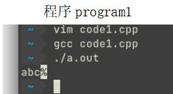
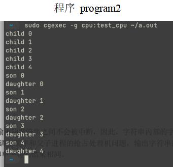
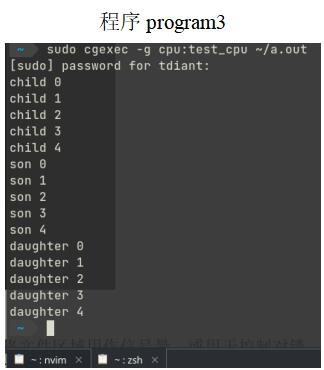

# 进程管理                     

## 一、实验目的

1. 加深对进程概念的理解，明确进程和程序的区别。
2. 进一步认识并发执行的实质。
3. 分析进程竞争资源现象，学习解决进程互斥的方法。

## 二、实验内容（实验步骤、源程序代码和实验结果）

### 1、实验步骤

步骤如下。

#### 任务1 进程的创建

1. 进入Linux系统，打开终端Terminal，使用如下指令切换至用户目录中。

```
cd ~
```

2. 使用vim编辑器，创建 code1.c 文件，并编写代码，指令如下。

```
vim code1.c
```

3. 按i键进入vim编辑器的编辑模式，输入代码。
4. 按Esc键退出编辑模式，直接输入如下指令保存并退出vim编辑器。

```
:wq
```

5. 使用如下指令，调用gcc编译程序源代码。该指令可将code2.c文件编译为program2可执行文件。

```
 gcc code1.c -o program1
 ```

6. 使用如下指令，运行程序。

```
 ./program1
```

观察结果。  
本任务至此完毕。

#### 任务2 进程的控制

为方便观察效果，首先为系统启用cgroup功能（此处略），然后配置cgroup。  

cgroup可以限制进程使用的系统资源，此处控制进程的CPU时间片，从而人为干预操作系统调度进程的CPU时间片，造成人为卡顿，便于观察现象。

1. 切换至root用户下。

```
su
```

2. 创建一个CPU Cgroup，此处叫做test_cpu。

```
mkdir /sys/fs/cgroup/test_cpu
```

*注：此处实验以cgroup v2为例，如果为v1，应当在/sys/fs/cgroup/cpu/下创建test_cpu。*

3. 配置cgroup，设置其CPU时间片。

```
echo "1 10"  > /sys/fs/cgroup/test_cpu/cpu.max
```

*注：此处实验以cgroup v2为例，如果为v1，应当使用echo指令分别修改`cpu.cfs_quota_us`与`cpu.cfs_period_us`为`1`和`10`。*

此处的两个时间单位均为微秒，它表示将时间周期长度为10us，在一个周期内，最多能使用CPU的时间为`1us`。  
此时间限制已经远低于正常CPU工作所用时间（甚至低于Intel 80286 CPU），显然，在此cgroup中运行的程序将会十分卡顿。

4. 参照任务1的步骤，创建code2.c文件，编写代码，使用gcc编译。
5. 重复任务1的步骤，创建code3.c文件，编写代码，使用gcc编译。
6. 使用cgexec或其他同类工具依次运行两个程序。

观察结果。  
本任务至此完毕。


### 2、源程序代码（程序代码中需要有必要的注释说明）

#### 任务1 进程的创建

```c++
#include<stdio.h>
#include<unistd.h>    
int main()
{
    pid_t p1, p2;
    //创建第一个子进程，如果错误则不断重试
    while((p1=fork())<0);
    if(p1==0)
    {
        //第一个子进程
        putchar('b');
    } else {
        //创建第二个子进程，如果错误则不断重试
        while((p2=fork())<0);
        if(p2==0)
        {
            //第二个子进程
            putchar('c');
        } else {
            //父进程
            putchar('a');
        }
    }
}
```

#### 任务2 进程的控制

程序代码1（code2.c）

```c++
#include<stdio.h>
#include<stdlib.h>
#include<unistd.h>
int main()
{
    pid_t p1, p2;
    int i;
    if(p1=fork())
    {
        //父进程
        for(i=0;i<5;i++) 
            printf("child %d\n",i);
    } else {
        if(p2=fork())
        {
            //第一个子进程
            for(i=0;i<5;i++)
                printf("son %d\n",i);
        } else {
            //第二个子进程
            for(i=0;i<5;i++) 
                printf("daughter %d\n",i);
        }
    }
}
```

程序代码2（code3.c）

```c++
#include<stdio.h>
#include<unistd.h>

int main()
{
    pid_t p1,p2;
    int i;
    if(p1=fork())
    {
        //父进程
        lockf(1,1,0); //锁定标准输出
        for(i=0;i<5;i++)
            printf("child %d\n",i);
        lockf(1,1,0); //解锁标准输出
    } else {
        if(p2=fork())
        { 
            //第一个子进程
            lockf(1,1,0); //锁定标准输出
            for(i=0;i<5;i++)
                printf("son %d\n",i);
            lockf(1,1,0); //解锁标准输出
         } else { 
            //第二个子进程
            lockf(1,1,0); //锁定标准输出
            for(i=0;i<5;i++)
                printf("daughter %d\n",i);
            lockf(1,0,0); //解锁标准输出
        }
    }
}
```

### 3、实验结果

#### 任务1 进程的创建

程序program1



*注：百分号是该终端软件表示标准输出结束的标志，这不是代码输出内容的一部分*

**结果分析**

fork函数可将运行着的程序分成了两个完全一样的进程，每个进程都将从代码的同一位置开始执行，从而达到创建进程的目的。fork函数的返回值为pid_t类型（本质为unsigned short类型），如果为负数代表创建失败，为0代表返回到新创建的子进程，正值表示返回父进程，且值为子进程的进程PID。  
在该实验中，首先使用fork函数创建了创建了一个子进程，PID存储在p1中。所创建的子进程将执行外层if语句的else分支部分的代码，在此代码中，又通过调用fork函数创建了该子进程的子进程，PID存储在p2中。  
此结构的好处是，父进程恰好能够执行if分支部分的代码，子进程恰好能执行else分支部分的代码，如Linux Manual中所述的如下示例伪代码所述。

```
if ((pid = fork()) == 0) 
          print "hello from the child" 
else 
          print "hello from the parent"
```

对于本任务的代码，三个进程之间的关系如下表所述。

进程PID | 角色 | 父进程PID | 功能
-|-|-|-
— | 父进程 | — | 输出字符a
p1 | 子进程 | — | 输出字符b
p2 | 子进程 | p1 | 输出字符c

由于三个进程之间的运行彼此独立，输出字符的顺序会因为具体的系统运行情况发生一定的变化，制约因素包括putchar函数输出一个字符所用的具体时间、fork函数创建子进程所用的时间等。

#### 任务2 进程的控制

程序 program2



**结果分析**：

本程序的运行原理与任务1一致，三个进程之间的关系如下表所述。
进程PID | 角色 | 父进程PID | 功能
-|-|-|-
— | 父进程 | — | 循环输出child i
p1 | 子进程 | — | 循环输出son i
p2 | 子进程 | p1 | 循环输出daughter i

运行的结果会因为实际的机器情况导致不同。此处因为父进程创建子进程中，系统内fork系统调用过于缓慢，而子进程fork系统调用较快，从而导致如上运行结果，经过多次实验可发现结果会有所不同，这说明三个进程正在彼此独立地向屏幕输出内容。

此程序将作下一个程序的对照，从而对比下一个程序得出最终的实验结果。

程序program3



**结果分析**：

此代码的基本原理与上一程序一致，但区别在于使用了lockf实现了对标准输出的锁，以此来实现进程控制的目的。

lockf可以调用信号量机制，通过允许将文件区域用作信号量，或用于控制对锁定进程的访问（此处为此用途）实现锁功能，它将接受三个参数。分别为：

第一个参数，`int fd`，表示文件描述符，此处设置为1，恰为POSIX规定的`STDOUT_FILENO`（即标准输出，指的是向终端输出内容的输出流），具体可参阅`unistd.h`的源码，摘录如下。此处1表示的具体含义为锁定的对象为标准输出。

```c++
enum STDIN_FILENO = 0;
enum STDOUT_FILENO = 1;
enum STDERR_FILENO = 2;
```

*注：此处是gcc编译器对libphobos的实现的源码，基于FreeBSD的实现。*  
*出处：*  
*https://github.com/gcc-mirror/gcc/blob/16e2427f50c208dfe07d07f18009969502c25dc8/libphobos/libdruntime/core/sys/posix/unistd.d*

第二个参数，`int cmd`表示要采取的操作的控制值。`0`表示`F_UNLOCK`，即解锁操作，`1`表示`F_LOCK`，即上锁操作。具体可参阅`unistd.h`的源码，摘录如下。

```c++
enum F_UNLOCK    = 0;
enum F_LOCK      = 1;
enum F_TLOCK     = 2;
enum F_TEST      = 3;
```

*注：出处与上一代码片段一致。*

第三个参数，`int len`，表示要操作的连续字节数。此处为0具有特殊含义，表示操作的区域为当前函数从头至尾。  

根据上述描述，可得知代码中的`lockf(1,1,0)`表示锁定屏幕输出，`lockf(1,0,0)`表示解除屏幕输出锁定，用法等同于信号量机制。  
在该代码中，每个进程在运行其自身指定的代码前均进行上锁操作，执行完毕后执行解锁操作，这使得每个进程输出的内容不会出现混乱的情况，一定是先输出完毕某一个进程的内容，再完全输出下一个进程的内容。三个进程之间的顺序会因为系统具体的情况而变。

## 三、实验中出现的问题和解决措施

**1、问题：输入gcc指令提示命令不存在。**

解决方案：在系统中安装build-essentials包。

**2、问题：任务2中的两个程序因系统性能问题，导致难以观察结果的差别。**

解决方案：采用Linux的cgroup机制手动对运行的进程做限制，限制其CPU时间片，从而使得实验结果易于观察。
