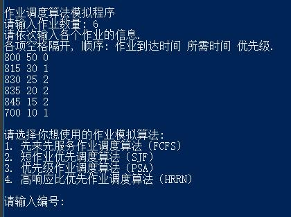
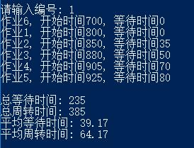
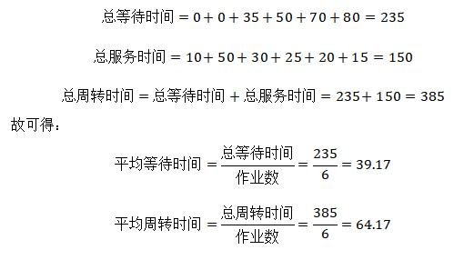
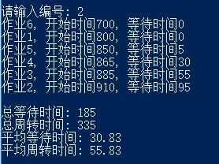
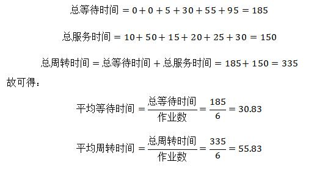
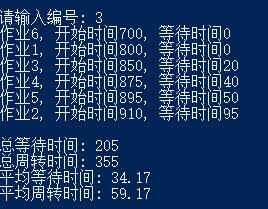
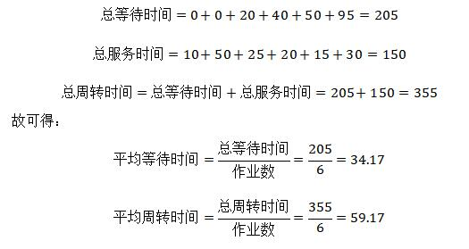
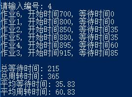
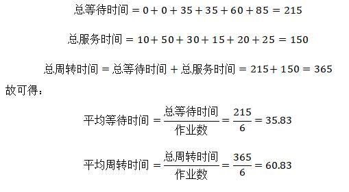

# 作业调度算法              

## 一、实验目的

1. 了解作业调度在操作系统中的作用。
2. 深入理解批处理系统中的作业调度的原理。

## 二、实验内容（实验步骤、源程序代码和实验结果）

我所选择实现的作业调度算法具体为：
1. 先来先服务作业调度算法（FCFS）
2. 短作业优先调度算法（SJF）
3. 优先级作业调度算法（PSA）
4. 高响应比优先作业调度算法（HRRN）
即**全选**。

### 1、实验步骤

下面对各作业调度算法的实验内容做阐述。

**① 先来先服务作业调度算法（FCFS**  
先来先服务作业调度算法（FCFS）指作业按照到达时间顺序依次处理。

**② 短作业优先调度算法（SJF）**  
短作业优先调度算法（SJF）指优先处理当前时间点之前所需时间最短的作业。

**③ 优先级作业调度算法（PSA）**  
优先级作业调度算法（PSA）指优先处理当前时间点之前优先级最大的作业。

**④ 高响应比优先作业调度算法（HRRN）**  
高响应比优先作业调度算法（HRRN）指优先处理当前时间节点前响应比更高的作业。其中对于响应比，有：


在每轮处理之前，需要重新计算各个作业的响应比。

**对于每一个作业调度算法而言，通用的处理流程如下：**  
第一步，找到当前未处理的作业中，符合对应作业调度算法所需的作业。
第二步，判断到达时间，如果到达时间大于当前时间，说明作业来了就能直接被运行；如果是其他情况，则现在才能被运行。
第三步，更新当前时间并记录统计信息。
第四步，重复从第一步开始处理其余作业，直至所有作业均被处理完毕。

**按照上述步骤，编写代码，并进行编译操作。**


### 2、源程序代码（程序代码中需要有必要的注释说明）

下述代码语言为C++。语言标准为C++98。
开发与运行环境须有完备的常用开发外设与X86平台的硬件。所需的运行环境为Linux Kernel版本4.0及以上；或Windows平台为Windows XP及以上，目标平台宜为64位处理器。
编译采用GCC(指g++) 5.0及以上版本（这意味着开发时未考虑兼容VC6等编译器），Windows环境可使用对应的具体实现（例如mingw）。

具体代码如下。

```c++
#include <stdio.h>

// 定义布尔数据类型，以便表示布尔量
#define BOOL int
#define TRUE 1
#define FALSE 0

// 最大作业数量
#define MAX_N 50
// 最大时间，即作业的到达时间、所需时间、开始时间与等待时间的最大值
#define MAX_TIME 10000

/**
 * 作业控制块（JCB）数据结构
 */
typedef struct
{
    // 用户指定的作业信息
    int id;                    // 作业编号
    int reachTime;             // 作业到达时间
    int needTime;              // 作业所需时间
    int privilege;             // 优先级

    // 系统标记
    BOOL visited;              // 作业是否被服务过

    double responseRatio;      // 响应比
    int startTime;             // 作业开始时间
    int waitTime;              // 作业等待时间
} JCB;

/**
 * 作业调度算法函数
 */
void FCFS();                   // 先来先服务作业调度算法（FCFS）
void SJF();                    // 短作业优先调度算法（SJF）
void PSA();                    // 优先级作业调度算法（PSA）
void HRRN();                   // 高响应比优先作业调度算法（HRRN）

/**
 * 作业队列
 */
int job_cnt = 0;               // 作业总数量
JCB jobs[MAX_N];               // 作业队列数组

/**
 * 作业工具管理工具函数
 */

// 向作业队列中添加作业
void AddJob(int reachTime, int needTime, int privilege);

// 交换两个作业的位置
void SwapJob(int i, int j);

// 清除作业的状态，将作业队列恢复到运行前的状态
void ResetJobsState();

// 获取未被运行的作业里，最早到达的作业
int GetEarlyJob();

// 获取未被运行的作业里，所需时间最少的作业
int GetMinJob(int now);

// 刷新响应比
int RefreshJobResponseRatio(int now);

/**
 * 输出工具函数
 */

// 输出本算法执行的最终结果
void ShowResult(int totWait, int totRound);

// 运行该作业
void RunJob(int id);

/**
 * 主函数
 */
int main()
{
    putchar('\n');
    printf("作业调度算法模拟程序");
    putchar('\n');

    printf("请输入作业数量: ");
    int n;
    scanf("%d", &n);

    printf("请依次输入各个作业的信息.\n");
    printf("各项空格隔开, 顺序: 作业到达时间 所需时间 优先级.\n");

    for (int i = 0; i < n; i++)
    {
        int a, b, c;
        scanf("%d%d%d", &a, &b, &c);
        AddJob(a, b, c);
    }

    while (TRUE)
    {
        putchar('\n');
        printf("请选择你想使用的作业模拟算法: \n");
        printf("1. 先来先服务作业调度算法（FCFS）\n");
        printf("2. 短作业优先调度算法（SJF）\n");
        printf("3. 优先级作业调度算法（PSA）\n");
        printf("4. 高响应比优先作业调度算法（HRRN）\n");
        putchar('\n');
        printf("请输入编号: ");

        int op;
        scanf("%d", &op);

        switch (op)
        {
            case 1:
                FCFS();
                break;
            case 2:
                SJF();
                break;
            case 3:
                PSA();
                break;
            case 4:
                HRRN();
                break;
        }

        ResetJobsState();
    }
}

void AddJob(int reachTime, int needTime, int privilege)
{
    JCB job;

    job.id = job_cnt + 1;
    job.reachTime = reachTime;
    job.needTime = needTime;
    job.privilege = privilege;
    job.visited = FALSE;

    jobs[job_cnt++] = job;
}

void SwapJob(int i, int j)
{
    JCB tmp = jobs[j];
    jobs[j] = jobs[i];
    jobs[i] = tmp;
}

void ResetJobsState()
{
    // 作业调度算法可能会打乱序列顺序
    // 因此需要利用排序，重新将作业顺序恢复为初始状态
    for (int i = 0; i < job_cnt; i++)
    {
        for (int j = i + 1; j < job_cnt; j++)
            if (jobs[i].id > jobs[j].id)
                SwapJob(i, j);
    }

    // 将各个作业的系统状态清空
    for (int i = 0; i < job_cnt; i++)
    {
        jobs[i].visited = FALSE;
        jobs[i].responseRatio = 0;
        jobs[i].startTime = 0;
        jobs[i].waitTime = 0;
    }
}

int GetEarlyJob()
{
    int pos = -1; // 最小的作业的对应下标

    for (int i = 0; i < job_cnt; i++)
    {
        // 忽略已经运行过的作业
        if (jobs[i].visited == TRUE)
            continue;

        // 寻找reachTime最小的作业
        if (pos == -1)
        {
            pos = i;
        } else
        {
            if (jobs[i].reachTime < jobs[pos].reachTime)
                pos = i;
        }
    }

    return pos;
}

int GetMinJob(int now)
{
    // 最小作业的对应下标 和 其花费的时间
    int pos = -1, cost = MAX_TIME;

    for (int i = 0; i < job_cnt; i++)
    {
        // 寻找在now这个时间节点之前，未被服务且所需时间最小的作业
        if (jobs[i].visited == FALSE && jobs[i].reachTime <= now && jobs[i].needTime < cost)
        {
            cost = jobs[i].needTime;
            pos = i;
        }
    }

    // 没找到的话，有可能是到达时间相同的作业里存在最优解
    // 需要重新搜索寻找
    if (pos == -1)
    {
        int earlyTime = MAX_TIME;
        for (int i = 0; i < job_cnt; i++)
        {
            if (jobs[i].visited == FALSE && jobs[i].reachTime < earlyTime)
            {
                earlyTime = jobs[i].reachTime;
                cost = jobs[i].needTime;
                pos = i;
            } else if (jobs[i].visited == FALSE && jobs[i].reachTime == earlyTime && jobs[i].needTime < cost)
            {
                cost = jobs[i].needTime;
                pos = i;
            }
        }
    }

    return pos;
}

void ShowResult(int totWait, int totRound)
{
    putchar('\n');
    printf("总等待时间: %d\n", totWait);
    printf("总周转时间: %d\n", totRound);
    printf("平均等待时间: %.2f\n", totWait * 1.0 / job_cnt);
    printf("平均周转时间: %.2f\n", totRound * 1.0 / job_cnt);
    putchar('\n');
}

void RunJob(int id)
{
    jobs[id].visited = TRUE;
    printf("作业%d, 开始时间%d, 等待时间%d\n", jobs[id].id, jobs[id].startTime, jobs[id].waitTime);
}

void FCFS()
{
    int now = 0, pos; //当前时间和当前正在服务的作业ID
    int totWait = 0, totRound = 0; //总等待时间与总周转时间

    pos = GetEarlyJob(); //先找到第一个最近作业作为标杆
    for (int i = 0; i < job_cnt; i++)
    {
        if (jobs[pos].reachTime > now)
        {
            // 如果当前检索的作业到达时间大于当前时间
            // 说明作业来了就能直接被运行
            jobs[pos].startTime = jobs[pos].reachTime;
            now = jobs[pos].reachTime;
        } else
        {
            // 其他情况的话，就是现在才能被运行
            jobs[pos].startTime = now;
        }

        // 计算作业等待时间
        jobs[pos].waitTime = now - jobs[pos].reachTime;

        // 运行作业
        RunJob(pos);

        // 更新当前时间并记录统计信息
        now += jobs[pos].needTime;
        totWait += jobs[pos].waitTime;
        totRound += jobs[pos].waitTime + jobs[pos].needTime;

        pos = GetEarlyJob(); //切换到下一个作业
    }

    // 输出结果
    ShowResult(totWait, totRound);
}

void SJF()
{
    int now = 0, pos; //当前时间和当前正在服务的作业ID
    int totWait = 0, totRound = 0; //总等待时间与总周转时间

    //先找到第一个到达的作业，以此寻找用时最短的作业
    pos = GetMinJob(jobs[GetEarlyJob()].reachTime);
    for (int i = 0; i < job_cnt; i++)
    {
        if (jobs[pos].reachTime > now)
        {
            // 如果当前检索的作业到达时间大于当前时间
            // 说明作业来了就能直接被运行
            jobs[pos].startTime = jobs[pos].reachTime;
            jobs[pos].waitTime = 0;
            now = jobs[pos].reachTime + jobs[pos].needTime;
        } else
        {
            // 其他情况的话，就是现在才能被运行
            jobs[pos].startTime = now;
            jobs[pos].waitTime = now - jobs[pos].reachTime;
            now += jobs[pos].needTime;
        }

        // 运行作业
        RunJob(pos);

        // 记录统计信息
        totWait += jobs[pos].waitTime;
        totRound += jobs[pos].waitTime + jobs[pos].needTime;

        pos = GetMinJob(now); //切换到下一个作业
    }

    // 输出结果
    ShowResult(totWait, totRound);
}

void PSA()
{
    // 先按照到达时间的先后顺序排序
    for (int i = 0; i < job_cnt; i++)
    {
        for (int j = i + 1; j < job_cnt; j++)
        {
            if (jobs[j].reachTime < jobs[i].reachTime)
                SwapJob(i, j);
        }
    }
    // 相同到达时间，按照优先级排序
    for (int i = 0; i < job_cnt; i++)
    {
        for (int j = i + 1; j < job_cnt; j++)
        {
            if (jobs[i].reachTime == jobs[j].reachTime && jobs[j].privilege > jobs[i].privilege)
                SwapJob(i, j);
        }
    }

    int now = 0, pos = 0; //当前时间和当前正在服务的作业ID
    int totWait = 0, totRound = 0; //总等待时间与总周转时间

    for (int i = 0; i < job_cnt; i++)
    {
        if (jobs[pos].reachTime > now)
        {
            // 如果当前检索的作业到达时间大于当前时间
            // 说明作业来了就能直接被运行
            jobs[pos].startTime = jobs[pos].reachTime;
            now = jobs[pos].startTime + jobs[pos].needTime;
        } else
        {
            // 其他情况的话，就是现在才能被运行
            jobs[pos].startTime = now;
            now += jobs[pos].needTime;
        }

        // 计算作业等待时间
        jobs[pos].waitTime = jobs[pos].startTime - jobs[pos].reachTime;

        // 运行作业
        RunJob(pos);

        // 更新当前时间并记录统计信息
        totWait += jobs[pos].waitTime;
        totRound += jobs[pos].waitTime + jobs[pos].needTime;

        // 寻找下一个作业
        int next = -1, maxPrivilege = -1; //下一个作业ID与当前最大优先级
        for (int j = 0; j < job_cnt && jobs[j].reachTime <= now; j++)
        {
            if (jobs[j].visited == TRUE)
                continue;
            // 寻找优先级最高且未被运行过的作业
            if (jobs[j].privilege > maxPrivilege)
            {
                maxPrivilege = jobs[j].privilege;
                next = j;
            }
        }

        // 如果没找到，那就顺延
        if (next == -1) next = pos + 1;
        pos = next;
    }

    // 输出结果
    ShowResult(totWait, totRound);

}

int RefreshJobResponseRatio(int now)
{
    int next = -1;  // 下一个要服务的作业的ID
    double maxResponseRatio = -1.0; // 当前寻找到的最大响应比

    // 不断地计算各个作业的响应比
    while (maxResponseRatio == -1.0)
    {
        // 先计算now之前有没有符合条件的作业
        for (int i = 0; i < job_cnt; i++)
        {
            if (jobs[i].visited == TRUE)
                continue;

            // 此处waitTime值，如果该作业在now之后，恰为负值，无法使得其大于0
            // 以此来实现计算出now之前的目的
            jobs[i].waitTime = now - jobs[i].reachTime;
            jobs[i].responseRatio = jobs[i].waitTime * 1.0 / jobs[i].needTime;

            if (jobs[i].responseRatio > maxResponseRatio)
            {
                maxResponseRatio = jobs[i].responseRatio;
                next = i;
            }
        }

        // 当前的最大响应比没有计算出来
        // 则寻找now之后的作业，判断有误符合条件的作业
        if (maxResponseRatio < 0)
        {
            int earlyTime = MAX_TIME;
            for (int j = 0; j < job_cnt; j++)
            {
                if (jobs[j].visited == TRUE)
                    continue;
                if (jobs[j].reachTime < earlyTime && jobs[j].reachTime > now)
                {
                    earlyTime = jobs[j].reachTime;
                    next = j;
                    jobs[j].responseRatio = jobs[j].waitTime * 1.0 / jobs[j].needTime;
                    maxResponseRatio = jobs[j].responseRatio;
                }
            }
        }
    }

    return next;
}

void HRRN()
{
    // 按照作业的到达时间排序
    for (int i = 0; i < job_cnt; i++)
    {
        for (int j = i + 1; j < job_cnt; j++)
        {
            if (jobs[j].reachTime < jobs[i].reachTime)
                SwapJob(i, j);
        }
    }

    int now = 0, pos; //当前时间和当前正在服务的作业ID
    int totWait = 0, totRound = 0; //总等待时间与总周转时间

    pos = RefreshJobResponseRatio(jobs[0].reachTime); // 先找到第一个作业
    for (int i = 0; i < job_cnt; i++)
    {
        if (jobs[pos].reachTime > now)
        {
            // 如果当前检索的作业到达时间大于当前时间
            // 说明作业来了就能直接被运行
            jobs[pos].startTime = jobs[pos].reachTime;
            jobs[pos].waitTime = 0;
            now = jobs[pos].startTime + jobs[pos].needTime;
        } else
        {
            // 其他情况的话，就是现在才能被运行
            jobs[pos].startTime = now;
            jobs[pos].waitTime = now - jobs[pos].reachTime;
            now += jobs[pos].needTime;
        }

        // 运行作业
        RunJob(pos);

        // 记录统计信息
        totWait += jobs[pos].waitTime;
        totRound += jobs[pos].waitTime + jobs[pos].needTime;

        if (i != job_cnt - 1) //如果是最后一个作业，那就没必要计算响应比了
            pos = RefreshJobResponseRatio(now);
    }

    // 输出结果
    ShowResult(totWait, totRound);

}

```


### 3、实验结果

#### 第一步 运行程序



**解释：**

程序编译并运行后，提示了欢迎信息，接着询问作业总数，并需要按照格式输入对应数量的作业，分别为这些作业提供 到达时间、所需时间以及优先级等信息。  
下面将以样例，共6个作业，信息如下表为例。

作业ID | 到达时间 | 所需时间 | 优先级
-|-|-|-
1 | 800 | 50 | 0
2 | 815 | 30 | 1
3 | 830 | 25 | 2
4 | 835 | 20 | 2
5 | 845 | 15 | 2
6 | 700 | 10 | 1

故有如上图所示的输入与输出的运行结果。  
输入完毕后，程序询问选择哪一种作业调度算法，可以根据实际情况，输入前面的数字以选择此作业调度算法。

#### 第二步 验证先来先服务作业调度算法（FCFS）

输入1并回车，选择FCFS。程序会模拟该作业调度算法，得出最终结果。



解释：
不妨以此作业调度算法，模拟其过程，如下表。

次序 | 作业ID | 到达时间 | 开始时间 | 等待时间 | 服务时间 | 结束时间
-|-|-|-|-|-|-
1 | 6 | 700 | 700 | 0 | 10 | 710
2 | 1 | 800 | 800 | 0 | 50 | 850
3 | 2 | 815 | 850 | 35 | 30 | 880
4 | 3 | 830 | 880 | 50 | 25 | 905
5 | 4 | 835 | 905 | 70 | 20 | 925
6 | 5 | 845 | 925 | 80 | 15 | 940

根据上表数据，有：



#### 第三步 验证短作业优先调度算法（SJF）

输入2并回车，选择SJF。程序会模拟该作业调度算法，得出最终结果。



解释：
不妨以此作业调度算法，模拟其过程，如下表。

次序 | 作业ID | 到达时间 | 开始时间 | 等待时间 | 服务时间 | 结束时间
-|-|-|-|-|-|-
1 | 6 | 700 | 700 | 0 | 10 | 710
2 | 1 | 800 | 800 | 0 | 50 | 850
3 | 5 | 845 | 850 | 5 | 15 | 865
4 | 4 | 835 | 865 | 30 | 20 | 885
5 | 3 | 830 | 885 | 55 | 25 | 910
6 | 2 | 815 | 910 | 95 | 30 | 940

根据上表数据，有：



#### 第四步 验证优先级作业调度算法（PSA）

输入3并回车，选择PSA。程序会模拟该作业调度算法，得出最终结果。



解释：
不妨以此作业调度算法，模拟其过程，如下表。

次序 | 作业ID | 到达时间 | 开始时间 | 等待时间 | 服务时间 | 结束时间
-|-|-|-|-|-|-
1 | 6 | 700 | 700 | 0 | 10 | 710
2 | 1 | 800 | 800 | 0 | 50 | 850
3 | 3 | 830 | 850 | 20 | 25 | 875
4 | 4 | 835 | 875 | 40 | 20 | 895
5 | 5 | 845 | 895 | 50 | 15 | 910
6 | 2 | 815 | 910 | 95 | 30 | 940

根据上表数据，有：




#### 第五步 验证高响应比优先作业调度算法（HRRN）

输入4并回车，选择HRRN。程序会模拟该作业调度算法，得出最终结果。



解释：
不妨以此作业调度算法，模拟其过程，如下表。

次序 | 作业ID | 到达时间 | 开始时间 | 等待时间 | 服务时间 | 结束时间
-|-|-|-|-|-|-
1 | 6 | 700 | 700 | 0 | 10 | 710
2 | 1 | 800 | 800 | 0 | 50 | 850
3 | 2 | 815 | 850 | 35 | 30 | 880
4 | 5 | 845 | 880 | 35 | 15 | 895
5 | 4 | 835 | 895 | 60 | 20 | 915
6 | 3 | 830 | 915 | 85 | 25 | 940

根据上表数据，有：




## 三、实验中出现的问题和解决措施

**问题1：优先级作业调度算法中，如何高效处理作业调度次序。**

解决措施：利用排序，先按照到达时间排序，再讲到达时间相同的作业按照优先级次序排序，即可按照顺序依次处理，实现高效处理。
