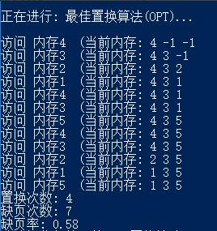

# 页面置换算法             

## 一、实验目的

1. 了解虚拟存储技术的技术特点。
2. 掌握请求页式存储管理的页面置换算法。

## 二、实验内容（实验步骤、源程序代码和实验结果）

我所选择实现的页面置换算法具体为：
1. 先进先出置换算法（FIFO）
2. 最佳置换算法（OPT）
3. 最近最久未使用置换算法（LRU）
4. 最少使用置换算法（LFU）
即**全选**。

### 1、实验步骤

**关于页面置换算法：**  
当发生缺页中断时，如果内存中没有空闲页面，需要选择内存中一个页面将其移出内存，以便为即将调入的页面留出存储空间。此处决策移出哪一页面的算法为页面置换算法。  

由此可见，对于每一次的内存调用，页面置换算法会遇到三种情况：  
第一种，调用的页面已位于内存中，则直接调用；  
第二种，调用的页面并没有位于内存中，但内存有空闲空间，则记录一次缺页，直接将被调用页面调入内存中；  
第三种，调用的页面并没有位于内存中，且内存没有空闲空间，则记录一次缺页，也意味着要发生页面置换，置换规则根据页面置换算法的具体情况而定。

**下面将对各置换算法的实验内容做阐述。**

**① 先进先出置换算法（FIFO）**  
先进先出置换算法（FIFO）将优先移出内存中最先被调入的页面。  

因此对于此页面置换算法，实验步骤设计如下：  
首先，设置一个一维数组作为模拟内存空间，定义一个变量p作为当前内存指针的位置，算法在执行时将利用此变量循环地遍历模拟内存空间中的每一个位置，这样做使得模拟内存空间形成了一个循环队列数据结构，从而实现了先进先出的算法特性。  
然后处理访问内存请求，每个请求要遍历一遍整个内存，以此来确定如下三种情况，做对应处理：  
第一种，调用的页面已位于内存中，则直接载入，访问内存；  
第二种，调用的页面并没有位于内存中，但内存有空闲空间，则记录一次缺页，直接将被调用页面调入内存中，然后访问内存；  
第三种，遍历完毕后，发现调用的页面并没有位于内存中，且内存没有空闲空间，则记录一次缺页，将当前内存位置p置换为所要访问的页面，并将p自增，即`p=(p+1) % MEMORY_LENGTH`，然后访问内存。  
最后，输出结果，显示缺页率、置换率等信息，以便分析。  

**② 最佳置换算法（OPT）**  
最佳置换算法（OPT）将优先移出未来最晚被使用到的页面。  

因此对于此页面置换算法，实验步骤设计如下：  
首先，设置一个一维数组作为模拟内存空间，在设置一个一维数组future用来记录各物理块上存储的页面未来多久要使用到。  
然后处理访问内存请求，每个请求要遍历一遍整个内存，以此来确定如下三种情况，做对应处理：  
第一种，调用的页面已位于内存中，则直接载入，更新此页面的future值，访问内存；  
第二种，调用的页面并没有位于内存中，但内存有空闲空间，则记录一次缺页，直接将被调用页面调入内存中，更新此页面的future值，然后访问内存；  
第三种，遍历完毕后，发现调用的页面并没有位于内存中，且内存没有空闲空间，则记录一次缺页，根据future找到最大值对应的页面，将其置换为访问的页面，然后访问内存。  
最后，输出结果，显示缺页率、置换率等信息，以便分析。  

**③ 最近最久未使用置换算法（LRU）**  
最近最久未使用置换算法（LRU）将优先移出目前最久没有被使用过的页面。  

因此对于此页面置换算法，实验步骤设计如下：  
首先，设置一个一维数组作为模拟内存空间，在设置一个一维数组time用来记录各物理块上存储的页面已经有多久没有被使用过了。  
然后处理访问内存请求，每处理一个请求都要给目前内存中各个页面对应的time加1，每个请求要遍历一遍整个内存，以此来确定如下三种情况，做对应处理：  
第一种，调用的页面已位于内存中，则直接载入，访问内存，并清空其累计时长；  
第二种，调用的页面并没有位于内存中，但内存有空闲空间，则记录一次缺页，直接将被调用页面调入内存中，访问内存，并清空其累计时长；  
第三种，遍历完毕后，发现调用的页面并没有位于内存中，且内存没有空闲空间，则记录一次缺页，根据time找到最大值对应的页面（因为其意味着最久没被使用过），将其置换为访问的页面，然后访问内存。  
最后，输出结果，显示缺页率、置换率等信息，以便分析。  

**④ 最少使用置换算法（LFU）**
最少使用置换算法（LFU）将优先移出未来最晚被使用到的页面。

因此对于此页面置换算法，实验步骤设计如下：  
首先，设置一个一维数组作为模拟内存空间，在设置一个一维数组time用来记录各物理块上存储的页面被使用过几次。  
然后处理访问内存请求，每处理一个请求都要给目前内存中各个页面对应的time加1，每个请求要遍历一遍整个内存，以此来确定如下三种情况，做对应处理：  
第一种，调用的页面已位于内存中，则直接载入，访问内存，并为其time加1；  
第二种，调用的页面并没有位于内存中，但内存有空闲空间，则记录一次缺页，直接将被调用页面调入内存中，访问内存，并为其time加1；  
第三种，遍历完毕后，发现调用的页面并没有位于内存中，且内存没有空闲空间，则记录一次缺页，根据time找到最小值对应的页面（因为其意味着使用次数最少），将其置换为访问的页面，然后访问内存。  

**按照上述步骤，编写代码，并进行编译操作。**

### 2、源程序代码（程序代码中需要有必要的注释说明）

下述代码语言为C++。语言标准为C++98。  
开发与运行环境须有完备的常用开发外设与X86平台的硬件。所需的运行环境为Linux Kernel版本4.0及以上；或Windows平台为Windows XP及以上，目标平台宜为64位处理器。  
编译采用GCC(指g++) 5.0及以上版本（这意味着开发时未考虑兼容VC6等编译器），Windows环境可使用对应的具体实现（例如mingw）。  

具体代码如下。

```c++
#include<iostream>
#include<cstdio>
#include<cstdlib>
#include<ctime>

#define MAX_N 100

/**
 * 全局设置项
 */
int pageCnt;              // 页面数
int memCnt;               // 内存物理块数
int visitCnt;             // 访问序列数量
int visitArr[MAX_N];      // 访问序列

/**
 * 置换算法实现
 */
void FIFO(int v[], int ram[]);     // 先进先出置换算法
void  OPT(int v[], int ram[]);     // 最佳置换算法
void  LRU(int v[], int ram[]);     // 最近最久未使用置换算法
void  LFU(int v[], int ram[]);     // 最少使用置换算法

/**
 * 工具函数组
 */

// 重置数组
// 将函数里的所有位置替换为某一数字
void RefreshArr(int arr[], int len, int x);

// 复制数组
// 将数组里的元素复制到另一个数组里
void CopyArr(int src[], int tar[], int len);

/**
 * 结果输出
 */

// 输出算法结果
// 在各个页面置换算法实现函数中用以输出算法结果
void ShowResult(int replaceCnt, int lackCnt, int visitCnt);

// 访问内存
void ReadMem(int id, int ram[], int len);

//

/*
 * 主函数
 */
int main()
{
    printf("\n页面置换算法模拟程序\n\n");
    printf("请输入下列设置项:\n");

    // 输入用户设置信息
    printf("页面数: ");
    scanf("%d", &pageCnt);
    printf("内存物理块数: ");
    scanf("%d", &memCnt);
    printf("访问序列长度: ");
    scanf("%d", &visitCnt);

    // 访问序列
    printf("是否随机生成访问序列? (输入 Y/n)");
    char opVisit = getchar();
    if(getchar()=='n')
    {
        // 用户自行输入访问序列
        printf("请依次输入访问序列各个元素, 用空格隔开: \n");
        for(int i=0; i<visitCnt; i++)
        {
            scanf("%d",&visitArr[i]);
        }
    } else {
        // 随机访问序列
        srand((unsigned)time(NULL));
        printf("随机生成的访问序列为: ");
        for(int i=0; i<visitCnt;i++) 
        {
            visitArr[i]=rand()%pageCnt;
            printf("%d ", visitArr[i]);
        }
        putchar('\n');
    }

    // 主选择菜单
    for(;;)
    {
        int v[visitCnt]; //访问序列的备份
        CopyArr(visitArr, v, visitCnt);

        int ram[memCnt]; //模拟内存
        RefreshArr(ram, memCnt, -1);

        printf("请选择你想使用的页面置换算法: \n");
        printf("1. 先进先出置换算法 (FIFO)\n");
        printf("2. 最佳置换算法 (OPT)\n");
        printf("3. 最近最久未使用置换算法 (LRU)\n");
        printf("4. 最少使用置换算法 (LFU)\n");

        int op;
        scanf("%d", &op);
        switch(op)
        {
            case 1:
                FIFO(v, ram);
                break;
            case 2:
                OPT(v, ram);
                break;
            case 3:
                LRU(v, ram);
                break;
            case 4:
                LFU(v, ram);
                break;
        }

        putchar('\n');
    }
}

void RefreshArr(int arr[], int len, int x) 
{
    for(int i=0; i<len; i++)
    {
        arr[i] = x;
    }
}

void CopyArr(int src[], int tar[], int len)
{
    for(int i=0; i<len; i++)
    {
        tar[i] = src[i];
    }
}

void ShowResult(int replaceCnt, int lackCnt, int visitCnt)
{
    printf("置换次数: %d\n", replaceCnt);
    printf("缺页次数: %d\n", lackCnt);
    printf("缺页率: %.2f", (lackCnt*1.0/visitCnt));
}

void ReadMem(int id, int ram[], int len)
{
    printf("访问 内存%d  (当前内存: ", id);
    for(int i=0; i<len; i++)
    {
        printf("%d", ram[i]);
        if(i>len-1) printf(")");
        else printf(" ");
    }
    putchar('\n');
}

void FIFO(int v[], int ram[])
{
    printf("\n正在进行: 先进先出置换算法(FIFO)...\n\n");
    int tag=0; //内存状态标记
    int p=0; //当前指针位置
    int replaceCnt=0, lackCnt=0; //置换次数与缺页次数

    for(int i=0; i<visitCnt; i++)
    {
        for(int j=0; j<memCnt; j++)
        {
            // 在内存中
            // 直接访问
            if(ram[j]==v[i])
            {
                ReadMem(v[i], ram, memCnt);
                tag=1;
                break;
            }
            // 不在内存中，但是内存未满
            // 纪录缺页，加载后访问内存
            if(ram[j]==-1)
            {
                lackCnt++;
                ram[j]=v[i];
                ReadMem(v[i], ram, memCnt);
                tag=1;
                break;
            }
        }
        // 内存已满且不在内存中
        // 进行FIFO置换
        if(tag==-1)
        {
            ram[p]=v[i];
            p=(p+1)%memCnt;
            replaceCnt++;
            lackCnt++;
            ReadMem(v[i], ram, memCnt);
        }

        // 本轮结束，复原tag标记
        tag=-1;
    }

    // 输出结果
    ShowResult(replaceCnt, lackCnt, visitCnt);
}

int FindFuture(int v[], int now, int cnt, int x)
{
    for(int i=now+1; i<cnt; i++)
    {
        if(v[i]==x)
            return i;
    }
    return 2333; //未找到返回错误编号
}

void OPT(int v[], int ram[])
{
    printf("\n正在进行: 最佳置换算法(OPT)...\n\n");
    int tag=0; //内存状态标记
    int p=0; //当前指针位置
    int replaceCnt=0, lackCnt=0; //置换次数与缺页次数

    int future[memCnt]; //纪录各块未来多久要使用到
    RefreshArr(future, memCnt, -1);

    for(int i=0; i<visitCnt; i++)
    {
        for(int j=0; j<memCnt; j++)
        {
            // 在内存中
            // 直接访问
            if(ram[j]==v[i])
            {
                ReadMem(v[i], ram, memCnt);
                future[j]=FindFuture(v, i, visitCnt, ram[j]);
                tag=1;
                break;
            }
            // 不在内存中，但是内存未满
            // 纪录缺页，加载后访问内存
            if(ram[j]==-1)
            {
                lackCnt++;
                ram[j]=v[i];
                ReadMem(v[i], ram, memCnt);
                future[j]=FindFuture(v, i, visitCnt, ram[j]);
                tag=1;
                break;
            }
        }
        // 内存已满且不在内存中
        // 进行OPT置换
        if(tag==-1)
        {
            int m=0; //纪录最大值位置
            for(int k=0; k<memCnt; k++)
            {
                if(future[k]>future[m])
                    m=k;
            }
            ram[m]=v[i];
            future[m]=FindFuture(v, i, visitCnt, ram[m]);
            replaceCnt++;
            lackCnt++;
            ReadMem(v[i], ram, memCnt);
        }

        // 本轮结束，复原tag标记
        tag=-1;
    }

    // 输出结果
    ShowResult(replaceCnt, lackCnt, visitCnt);
}

void LRU(int v[], int ram[])
{
    printf("\n正在进行: 最近最久未使用置换算法(LRU)...\n\n");
    int tag=0; //内存状态标记
    int p=0; //当前指针位置
    int replaceCnt=0, lackCnt=0; //置换次数与缺页次数

    int time[memCnt]; //纪录各块已有多久未使用过了
    RefreshArr(time, memCnt, -1);

    for(int i=0; i<visitCnt; i++)
    {
        for(int j=0; j<memCnt; j++)
        {
            if(time[j]!=-1)
                time[j]++; //为各块累加一次时间
        }

        for(int j=0; j<memCnt; j++)
        {
            // 在内存中
            // 直接访问
            if(ram[j]==v[i])
            {
                ReadMem(v[i], ram, memCnt);
                time[j]=0; //被访问就清空其累计时长
                tag=1;
                break;
            }
            // 不在内存中，但是内存未满
            // 纪录缺页，加载后访问内存
            if(ram[j]==-1)
            {
                lackCnt++;
                ram[j]=v[i];
                ReadMem(v[i], ram, memCnt);
                time[j]=0; //被访问就清空其累计时长
                tag=1;
                break;
            }
        }
        // 内存已满且不在内存中
        // 进行LRU置换
        if(tag==-1)
        {
            int m=0; //纪录最大值位置
            for(int k=0; k<memCnt; k++)
            {
                if(time[k]>time[m])
                    m=k;
            }
            ram[m]=v[i];
            time[m]=0;
            replaceCnt++;
            lackCnt++;
            ReadMem(v[i], ram, memCnt);
        }

        // 本轮结束，复原tag标记
        tag=-1;
    }

    // 输出结果
    ShowResult(replaceCnt, lackCnt, visitCnt);
}

void LFU(int v[], int ram[])
{
    printf("\n正在进行: 最少使用置换算法(LFU)...\n\n");
    int tag=0; //内存状态标记
    int p=0; //当前指针位置
    int replaceCnt=0, lackCnt=0; //置换次数与缺页次数

    int time[memCnt]; //纪录各块被使用次数
    RefreshArr(time, memCnt, 0);

    for(int i=0; i<visitCnt; i++)
    {
        for(int j=0; j<memCnt; j++)
        {
            // 在内存中
            // 直接访问
            if(ram[j]==v[i])
            {
                ReadMem(v[i], ram, memCnt);
                time[j]++; //被访问就累计使用次数
                tag=1;
                break;
            }
            // 不在内存中，但是内存未满
            // 纪录缺页，加载后访问内存
            if(ram[j]==-1)
            {
                lackCnt++;
                ram[j]=v[i];
                ReadMem(v[i], ram, memCnt);
                time[j]++; //被访问就累计使用次数
                tag=1;
                break;
            }
        }
        // 内存已满且不在内存中
        // 进行LFU置换
        if(tag==-1)
        {
            int m=0; //纪录最小值位置
            for(int k=0; k<memCnt; k++)
            {
                if(time[k]<time[m])
                    m=k;
            }
            ram[m]=v[i];
            time[m]=1;
            replaceCnt++;
            lackCnt++;
            ReadMem(v[i], ram, memCnt);
        }

        // 本轮结束，复原tag标记
        tag=-1;
    }

    // 输出结果
    ShowResult(replaceCnt, lackCnt, visitCnt);
}
```


### 3、实验结果

#### 第一步 运行程序


**解释：**  

程序编译并运行后，提示欢迎信息，接着询问页面数、内存物理块数与访问序列长度，可以根据实际情况选择随机生成访问序列（键入Y并回车）或自行输入访问序列（键入字符n并回车）两种模式。

下面以样例，一共有5个页面，内存物理块数为3，页面按照`4 3 2 1 4 3 5 4 3 2 1 5`的顺序访问，故有上面的输入与输出的运行结果。  
输入完毕后，程序询问选择哪一种置换算法，可以根据实际情况，输入前面的数字以选择此置换算法。

#### 第二步 验证先进先出置换算法（FIFO）

输入1并回车，选择FIFO。程序会模拟该置换算法，得出最终结果。


**解释：**

不妨按照此访问序列，以先进先出置换算法的思想模拟其过程。


#### 第三步 验证最佳置换算法（OPT）

输入2并回车，选择OPT。程序会模拟该置换算法，得出最终结果。



**解释：**

不妨按照此访问序列，以最佳置换算法的思想模拟其过程。


#### 第四步 验证最近最久未使用置换算法（LRU）

输入3并回车，选择LRU。程序会模拟该置换算法，得出最终结果。


**解释：**

不妨按照此访问序列，以最近最久未使用置换算法的思想模拟其过程。


综上，得到如上图所示的运行结果。

#### 第五步 验证最少使用置换算法（LFU）

输入4并回车，选择LFU。程序会模拟该置换算法，得出最终结果。


**解释：**

不妨按照此访问序列，以最少使用置换算法的思想模拟其过程。


至此，本实验所有任务均完成。

## 三、实验中出现的问题和解决措施

**问题1：如何解决OPT算法中所需要的future的求解问题？**

解决措施：在已知访问序列的前提下，对序列未被遍历的部分进行遍历统计。

**问题2：先进先出置换算法中，如何保证先进先出机制？**

解决措施：使用利用模拟内存数组的线性特性，定义一个当前位置指针变量，模拟简单循环队列数据结构，即可解决此问题。
