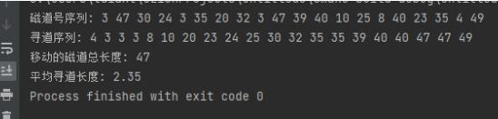

# 磁盘调度

## 一、实验目的

理解磁盘调度原理。

## 二、实验内容（实验步骤、源程序代码和实验结果）

在本实验中，我选择实现最短寻道时间优先算法。

### 1、实验步骤

针对实验中算法的具体情况，设计如下实验步骤：

1. 利用rand函数，随机产生磁道号序列，随机选择一条磁道作为起点寻道。
2. 计算其他磁道与当前磁道之间的距离。
3. 在其中选择距离最小的磁道，即距离当前磁道最近的磁道。
4. 以当前磁道为起点，继续计算其他未被访问磁道与其的距离，选择数值最小的磁道来访问。

### 2、源程序代码（程序代码中需要有必要的注释说明）

```c++
#include<stdio.h>
#include<time.h>
#include<stdlib.h>

#define MAX_M 50
#define MAX_N 20

int arr[MAX_N];         //随机产生的访问的磁道号序列
int num_dis[MAX_N];     //当前磁道与其他磁道的距离
int tot = 0;            //已被访问的磁道号个数
int all_cnt = 0;        //移动的磁道总数

/**
 * SSTF算法 
 */
void SSTF(int index);

int main()
{
    srand(time(NULL));

    printf("磁道号序列: ");
    for (int i = 0; i <= MAX_N - 1; i++)
    {    //随机产生要进行寻道访问的磁道号序列
        arr[i] = rand() % (MAX_M + 1);
        printf("%d ", arr[i]);
    }

    printf("\n寻道序列: ");
    SSTF(rand() % MAX_N);

    //输出结果
    printf("\n移动的磁道总长度: %d\n", all_cnt);
    printf("平均寻道长度: %0.2lf", (double) all_cnt / MAX_N);
    return 0;
}

void SSTF(int index)
{
    //输出当前磁道
    printf("%d ", arr[index]);

    //预处理
    int x; //辅助变量，用以表示最短磁道编号
    num_dis[index] = -1;
    tot++;    //已被访问磁道号+1

    // 结束判定
    if (tot == MAX_N)
        return;

    //计算距离
    for (int i = 0; i <= MAX_N - 1; i++)
    {    //计算其他磁道与当前被访问磁道的距离
        if (num_dis[i] != -1)
        {
            num_dis[i] = abs(arr[index] - arr[i]);
        }
    }

    // 选择最短
    int min = 9999;
    for (int i = 0; i <= MAX_N - 1; i++)
    {
        if (num_dis[i] != -1)
        {
            if (num_dis[i] < min)
            {
                min = num_dis[i];
                x = i;
            }
        }
    }

    //计算当前磁道与下一磁道的距离
    all_cnt += abs(arr[index] - arr[x]);

    //遍历下一个磁道
    SSTF(x);
}
```

### 3、实验结果



## 三、实验中出现的问题和解决措施

**1、问题：随机生成的磁道号序列会存在重复的问题**
 
解决方法：利用srand函数更新随机数种子为程序运行时的时间戳
