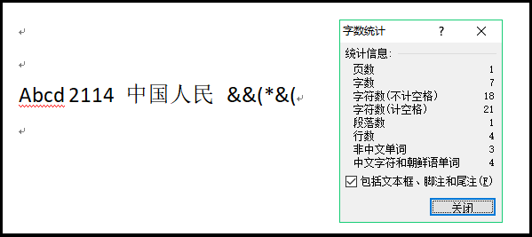
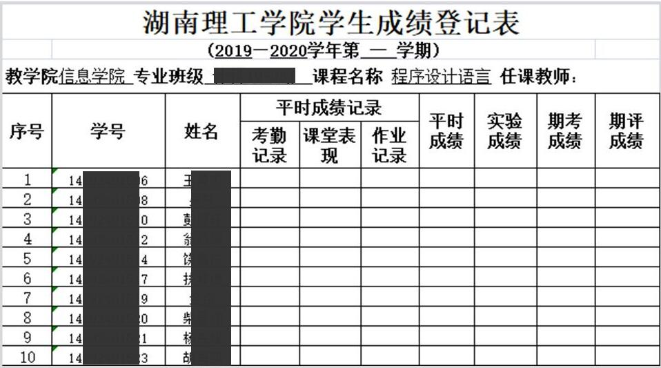
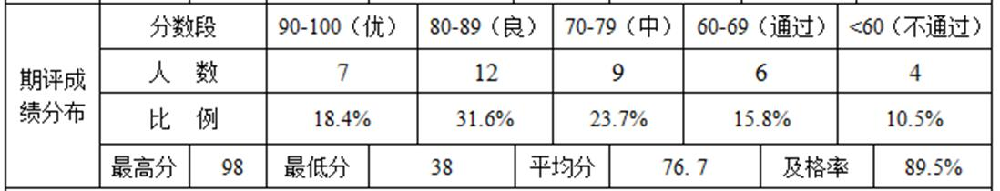

# 程序设计基础实验

本目录存放**大一上半学期**所修读的**程序设计基础**课程中实验课要求完成的实验报告文件。

# 内容 

项目 | 对应文件 
-|-
实验1 | sy1.md
实验2 | sy2.md
实验3 | sy3.md
实验4 | sy4.md
实验6 | sy6.md
实验7 | sy7.md
实验8 | sy8.md
实验9 | sy9.md
实验10 | sy10.md
实验11 | sy11.md, name.txt

# 详情

## 实验1: 长方形周长面积计算

### 实验要求原述

实验任务：给定长方形的长a和宽b，计算并显示：

1. 长方形周长c
2. 长方形面积s
3. 长方形对角线长度d（选做）

完成实验任务，填写并提交实验报告。

### 完成方式

按照题目要求开发。  
最终提供了本作业指定的实验报告doc文件，以zip压缩包形式发送。

## 实验2: 成绩等级判定

### 实验要求原述

实验任务：给定一个100分制成绩s，计算等级成绩，并显示等级：

1. 90 - 100分，等级为“A”；
2. 80 - 89分，等级为“B”；
3. 70 - 79分，等级为“C”；
4. 60 - 69分，等级为“D”；
6. 60分以下，等级为“E”；

完成实验任务，填写并提交实验报告。

### 完成方式

原要求题目要求中序号错误，不影响完成本任务。  
按照题目要求开发。  
最终提供了本作业指定的实验报告doc文件，以zip压缩包形式发送。

## 实验3: 单科成绩统计

### 实验要求原述

实验任务：假设一个班级30人，请编写程序，按照表1要求，帮助老师分析C语言课程的考试情况：

1. 定义数组，存放随机生成的30个成绩（整数）；
2. 统计各分数段人数及比例；
3. 计算最高分、最低分、平均分、及格率。

请按要求完成实验任务，填写并提交实验报告。

### 完成方式

按照题目要求开发，流程图用Draw.io完成。  
最终提供了本作业指定的实验报告doc文件以及所要求的流程图大图文件，以zip压缩包形式发送。

## 实验4: Word字数统计

### 实验要求原述

请编写程序，参照word软件的字数统计功能，统计以下信息：

1. 字符数（计空格），1个汉字按1个汉字字符计算；
2. 字符数（不计空格）；
3. 字数；（1个汉字按1个字计数；连续非汉字字符按1个字计数）。

图1 Word字数统计示例  

请按要求完成实验任务，填写并提交实验报告。

### 完成方式

按照题目要求开发，流程图用Draw.io完成。  
最终提供了本作业指定的实验报告doc文件以及所要求的流程图大图文件，以zip压缩包形式发送。

## 实验5

本实验任务一开始被下发下去，后续教师自行删除本任务。

## 实验6: 哥德巴赫猜想

### 实验要求原述

一、    实验任务

哥德巴赫猜想：任一大于2的偶数都可写成两个素数之和。请综合运用函数、循环、分支等知识，编写程序检验Goldbach猜想：

1. 请设计奇偶性判定函数；
2. 请设计素数判定函数；
3. 主函数要求：输入任意一个正整数x，若为大于2的偶数，请输出符合猜想的两个素数；

若不是大于2的偶数，则输出“Error”。

### 完成方式

按照题目要求开发。  
最终提供了本作业指定的实验报告doc文件，以zip压缩包形式发送。

## 实验7: 成绩分析系统

### 实验要求原述

实验任务:  
请综合运用函数、循环、数组等知识，根据湖南理工学院学生成绩分析的需求（见表1和表2），设计和实现一个成绩分析系统：

1. 数据的定义；
2. 函数原型的设计；
3. 各个函数的实现；
4. 主函数的设计与实现。

注：平时、实验、期考成绩可以随机生成（分数范围：50-99之间）。

表1. 成绩登记表  

表2. 成绩分布表  

*注：此处教师所布置的任务中，表1所配图片中存在真实的学生信息，此处抹去，原作业内容没有此处的图片处理操作。*

### 完成方式

按照题目要求开发。  
最终提供了本作业指定的实验报告doc文件，以zip压缩包形式发送。

## 实验8: 棋盘问题的递归设计

### 实验要求原述

实验任务

如图所示，给定一个mxn的棋盘，从左下角（1, 1）走到右上角（m, n），每次只能向上或者向右走一格，请问有多少种走法？

（1）请设计递归函数f（m, n），计算从（1, 1）到（m, n）不同走法的数目。

（2）拓展选做：试着把所有的走法列出来。每种走法可按单元格的顺序排列，例如：在m=3，n=4的棋盘中，(1,1)(1,2)(2,2)(2,3)(3,3)(3,4)是一种走法。

### 完成方式

按照题目要求开发。  
最终提供了本作业指定的实验报告doc文件，以zip压缩包形式发送。

## 实验9: 日期计算

### 实验要求原述

综合运用结构体、函数等知识，完成下面实验任务：

1. 任意给定两个日期d1和d2，请计算d2-d1日期之差；
2. 给定一个日期d1，计算x天之后的日期d2；
3. 给定本学期开学日期d，计算今天是本学期第几周。

### 完成方式

按照题目要求开发。  
最终提供了本作业指定的实验报告doc文件，以zip压缩包形式发送。

## 实验10: 字符串查找与替换

### 实验要求原述

 (其它)一、实验任务  
综合运用指针、函数、数组等知识，完成下面实验任务：

1. 编写字符串查找函数，在字串s1中找出字串s2第一次出现的位置，返回该位置的指针；  
2. 编写字符串替换函数，将字符串s中所有子串s1替换为s2，返回替换后的字符串；  
3. 模仿Word软件中的替换功能，对给定文本中的字串进行替换。

### 完成方式

按照题目要求开发。  
最终提供了本作业指定的实验报告doc文件，以zip压缩包形式发送。

## 实验11: 成绩表文件读写

### 实验要求原述

 (其它)一、实验任务  
综合运用文件、结构体、函数等知识，完成下面实验任务：

1. 读取班级姓名文件“name.txt”，获取姓名，确定班级人数；
2. 自动生成学号，随机生成小三科成绩；
3. 按小三科总分从高到低排序，并标记学生班级排名；
4. 将排序后的成绩表，写入文件“成绩表.txt”。

另附附件`name.txt`。

*注: 本作业教师提供的附件文件`name.txt`中，存在真实学生姓名，已做处理，原文件中没有此处理。*

### 完成方式

按照题目要求开发。  
最终提供了本作业指定的实验报告doc文件与运行结果实例`成绩表.txt`文件，以zip压缩包形式发送。
