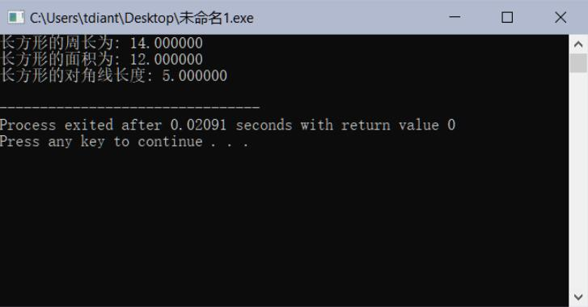
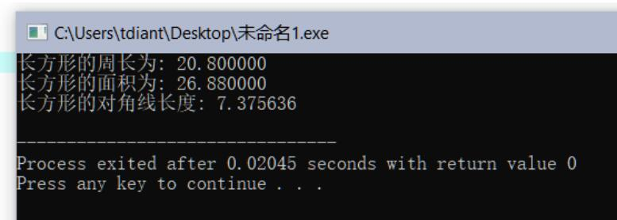

# 长方形周长面积计算

## 一、实验任务

给定长方形的长a和宽b，计算并显示：  

1. 长方形周长c
2. 长方形面积s
3. 长方形对角线长度d（选做）

## 二、实验设计

（1）变量定义

```c
double a = 1.2, b = 2;
double c, s, d;
```

（2）算术运算

```c
c = 2 * (a + b);
s = a * b;
d = sqrt(a * a + b * b);
```

（3）结果输出

```c
printf("长方形的周长为: %lf\n", c);
printf("长方形的面积为: %lf\n", s);
printf("长方形的对角线长度: %lf\n", d);
```


## 三、运行测试

1、测试1：给定长宽值，a=3，b=4  
运行结果（请截图）



2、测试2： a=5.6，b=4.8  
运行结果（请截图）



# 四、实验总结

## 1、程序编译时产生的错误及改正方法

**（1）错误：编译器提示Implicit conversion from 'double' to 'int'**

原因：在一开始定义变量时，将double类型的a与b定义为了int类型，导致浮点数无法正常存入变量a与b。

改正方法：将int改成double。

**（2）错误：编译器提示Expected ';' after expression**

原因：部分语句末尾忘记加分号以做结束，或者使用的是中文分号而非英文分号。

改正方法：在语句末尾加英文分号。

**（3）错误：提示Use of undeclared identifier 'sqrt'**

原因：没有引入math.h头文件。

改正方法：首行加入#include<math.h>。


## 2、程序运行结果不正确情况及改正方法

**（1）错误：输入 a=5.6，b=4.8时，输出的周长、面积与对角线长度是一些不正常的负整数。**

原因：printf的格式控制字符串中使用%d以输出double类型的c、s、d。
改正方法：将%d改为%lf。
