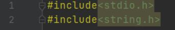
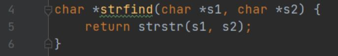
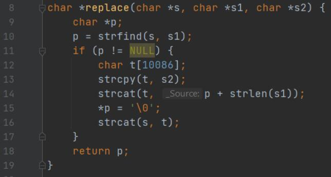
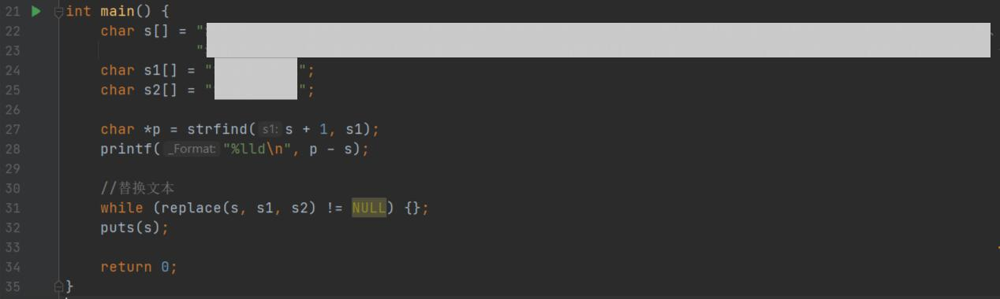

# 字符串查找与替换

## 一、实验任务

综合运用指针、函数、数组等知识，完成下面实验任务：

1. 编写字符串查找函数，在字串s1中找出字串s2第一次出现的位置，返回该位置的指针；
2. 编写字符串替换函数，将字符串s中所有子串s1替换为s2，返回替换后的字符串；
3. 模仿Word软件中的替换功能，对给定文本中的字串进行替换。

（1）实验设计

1、函数设计

**（1）字符串查找函数：**`char* strfind(char* s1, char* s2)`

功能说明：找出字串s2在字串s1中第一次出现的位置  
参数说明：s2的地址和s1的地址  
返回值说明：返回指针  

**（2）字符串替换函数：`char* replace(char* s, char* s1, char* s2)`**

功能说明：将字符串s中所有子串s1替换为s2。  
参数说明：s的地址 s1的地址 s2的地址  
返回值说明：返回指针  

2、程序代码  
（按函数截图）

预处理指令

strfind函数

replace函数

main函数

（2）运行测试

1、测试案例：

测试文本：【此处略】。  
要查找的字符串：【此处略】  
替换为的字符串：【此处略】  

运行结果（请截图）

【此处略】

（3）实验总结

### 1、程序编译时产生的错误及改正方法

//按下编译按钮后，程序出现的错误信息及相应修正方法

**（1）错误：编译器提示invalid conversion from 'const char*' to 'char' [-fpermissive]**

原因：main函数定义字符串时没有带[]。

改正方法：补充缺失的[]。

### 2、程序运行结果不正确情况及改正方法

//按下运行按钮后，出现的不正确的结果信息及相应修正方法

**（1）错误：程序异常退出，调试时警告Unexcepted pointer strfind**

原因：没有在声明strfind函数的时候在函数名前加*。

改正方法：补充缺失的*。

