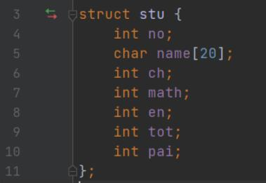
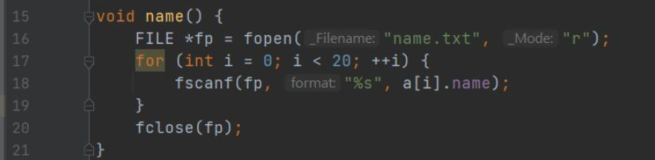
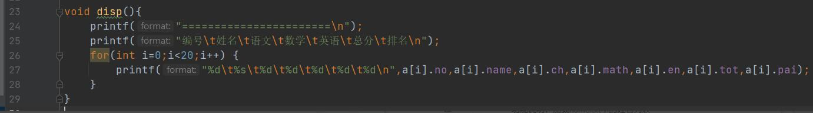
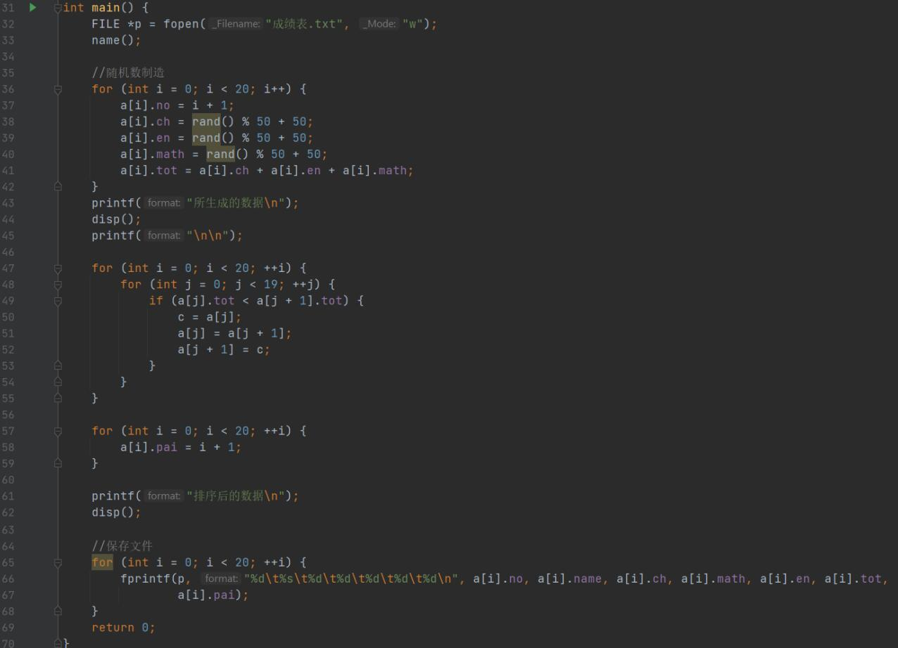
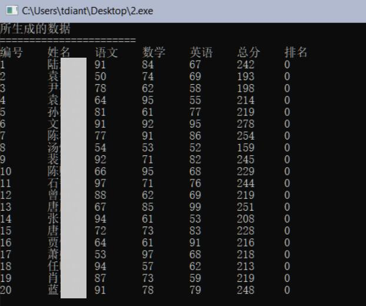
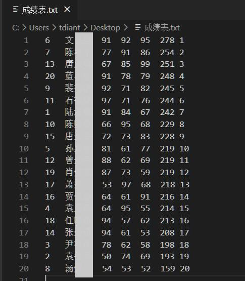

# 成绩表文件读写

## 一、实验任务

综合运用文件、结构体、函数等知识，完成下面实验任务：

1. 读取班级姓名文件“name.txt”，获取姓名，确定班级人数；
2. 自动生成学号，随机生成小三科成绩；
3. 按小三科总分从高到低排序，并标记学生班级排名；
4. 将排序后的成绩表，写入文件“成绩表.txt”。

## 二、实验设计

1、函数设计

**（1）函数：name**

函数原型：`void name() `  
功能说明：加载name.txt中的姓名列表  
参数说明：无  
返回值说明：无  

**（2）函数：disp**
函数原型：`void disp()`  
功能说明：将当前保存的数据按标准输出的方式输出  
参数说明：无  
返回值说明：无  

2、程序代码  
（按函数截图）

预处理指令

结构体stu

全局变量

函数name

函数disp

函数main

## 三、运行测试

1、排序前成绩表  
运行结果（请截图）

2、排序后成绩表  
运行结果（请截图成绩表文件的内容）

## 四、实验总结

1、程序编译时产生的错误及改正方法

//按下编译按钮后，程序出现的错误信息及相应修正方法

**（1）错误：编译器提示文件无读写权限**  

原因：没有指定fopen第二个参数所需的模式类型。

改正方法：给读操作加上模式 r，写操作加上 w。

**2、程序运行结果不正确情况及改正方法**

//按下运行按钮后，出现的不正确的结果信息及相应修正方法

**（1）错误：数字显示有问题，无法正常输出**

原因：没有严格控制好printf的格式控制字符串与后面所接形参的数据类型关系。

改正方法：修改格式控制字符串。

**（2)错误：各列无法实现对齐**  

原因：空格无法精准实现对齐，需要考虑使用Tab符。

改正方法：将所输出的空格改为 \t 。
