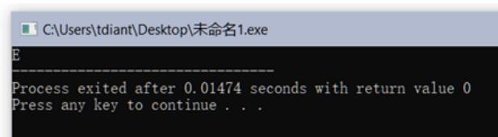
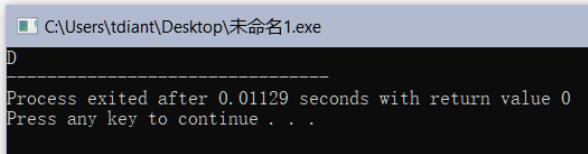
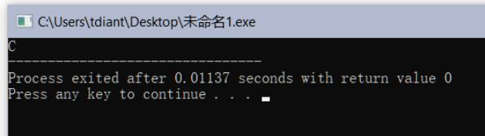
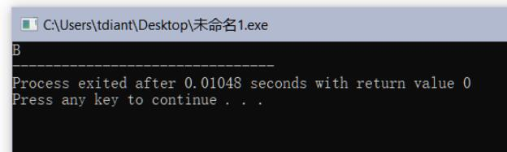
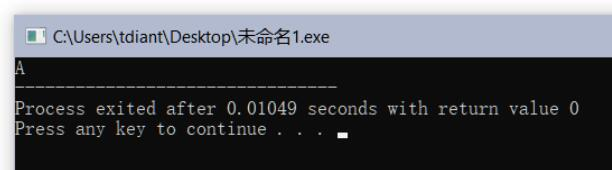
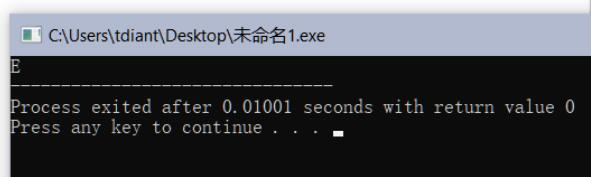
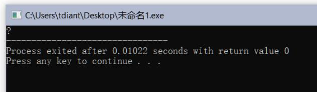

# 成绩等级判定

## 一、实验任务

给定一个100分制成绩s，计算等级成绩，并显示等级： 

1. 90 - 100分，等级为“A”；
2. 80 - 89分，等级为“B”；
3. 70 - 79分，等级为“C”；
4. 60 - 69分，等级为“D”；
5. 60分以下，等级为“E”；

## 二、实验设计

1、变量定义

```c
int s;
char c = '?';
```

2、等级判定及显示

```c
if (s >= 90 && s <= 100) c = 'A';
if (s >= 80 && s <= 89) c = 'B';
if (s >= 70 && s <= 79) c = 'C';
if (s >= 60 && s <= 69) c = 'D';
if (s < 60) c = 'E';

printf("%c", c);
```

## 三、运行测试

1、测试1：s=56  
运行结果（请截图）



2、测试2： s=66  
运行结果（请截图）




3、测试3： s=76  
运行结果（请截图）




4、测试4： s=86  
运行结果（请截图）



5、测试5： s=96  
运行结果（请截图）



6、测试6： s= -66  
运行结果（请截图）



7、测试7： s= 166  
运行结果（请截图）




## 四、实验总结

### 1、程序编译时产生的错误及改正方法

//按下编译按钮后，程序出现的错误信息及相应修正方法

**（1）错误：编译器提示Expected ';' after expression**

原因：部分语句末尾忘记加分号以做结束，或者使用的是中文分号而非英文分号。

改正方法：在语句末尾加英文分号。

**（2）错误：提示Use of undeclared identifier 'sqrt'**

原因：没有引入math.h头文件。

改正方法：首行加入#include<math.h>。

### 2、程序运行结果不正确情况及改正方法

//按下运行按钮后，出现的不正确的结果信息及相应修正方法

**（1）错误：当输入成绩为100时输出的是65，而不是A。
原因：格式控制字符串中使用的是%d而非%c。**

改正方法：将%d改正为%c。
