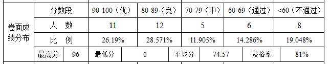
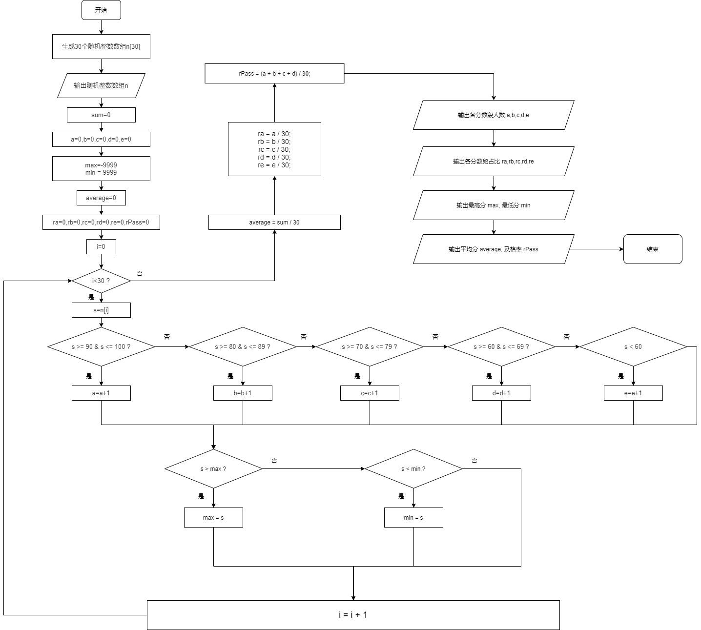
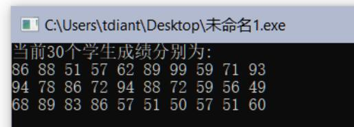
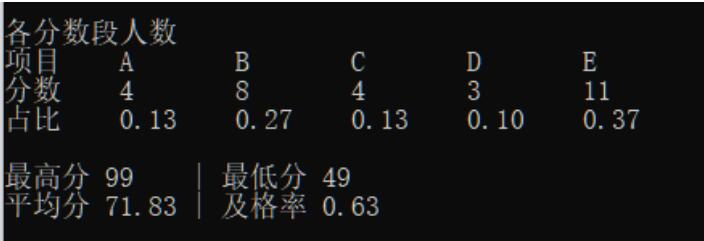

# 单科成绩统计

## 一、实验任务

假设一个班级30人，请编写程序，按照表1要求，帮助老师分析C语言课程的考试情况： 

1. 定义数组，存放随机生成的30个成绩（整数）；
2. 统计各分数段人数及比例；
3. 计算最高分、最低分、平均分、及格率。

表1. 试卷成绩分析表（某学院模板）


## 二、实验设计

1、流程图  
（可纸上画好，截图片）



（大图随附件上传）

2、程序代码  
（源代码）

```c
#include <stdio.h>
#include <stdlib.h>
#include <time.h>

int n[30];
int a=0, b=0, c=0, d=0, e=0, sum = 0, max = -999, min = 999;
double average, ra, rb, rc, rd, re, rPass;

int main() {
    //随机数生成
    for (int i = 0; i < 30; i++) {
        n[i] = (rand() % (100-45+1))+ 45;
    }
    printf("当前30个学生成绩分别为:\n");
    for (int i = 0; i < 10; i++)
        printf("%d ", n[i]);
    printf("\n");
    for (int i = 10; i < 20; i++)
        printf("%d ", n[i]);
	printf("\n");
	for (int i = 20; i < 30; i++)
        printf("%d ", n[i]);
    printf("\n\n");

    //扫描数据
    for (int i = 0; i < 30; ++i) {
        int s = n[i];

        //总和
        sum += s;

        //分数段
        if (s >= 90 && s <= 100)
            a += 1;
        else if (s >= 80 && s <= 89)
            b += 1;
        else if (s >= 70 && s <= 79)
            c += 1;
        else if (s >= 60 && s <= 69)
            d += 1;
        else if (s < 60)
            e += 1;

        //最高最低分
        if (s > max) max = s;
        if (s < min) min = s;
    }


    //数据处理
    average = sum * 1.0 / 30;
    ra = a * 1.0 / 30;
    rb = b * 1.0 / 30;
    rc = c * 1.0 / 30;
    rd = d * 1.0 / 30;
    re = e * 1.0 / 30;
    rPass = (a + b + c + d) * 1.0 / 30;

    printf("各分数段人数\n");
    printf("项目 \tA \tB \tC \tD \tE \n");
    printf("分数\t%d\t%d\t%d\t%d\t%d\n", a, b, c, d, e);
    printf("占比\t%.2lf\t%.2lf\t%.2lf\t%.2lf\t%.2lf\n\n", ra, rb, rc, rd, re);
    printf("最高分 %d    | 最低分 %d \n", max, min);
    printf("平均分 %.2lf | 及格率 %.2lf \n", average, rPass);

    return 0;
}
```

## 三、运行测试

1、测试1：

（1）随机生成45-100之间的30位同学的成绩（请截图）



（2）运行结果（请截图）



## 四、实验总结

### 1、程序编译时产生的错误及改正方法
//按下编译按钮后，程序出现的错误信息及相应修正方法

**（1）错误：编译器提示Use of undeclared identifier “rand”**

原因：没有引入stdlib.h头文件

改正方法：在开始处加入#include<stdlib.h>。

### 2、程序运行结果不正确情况及改正方法

//按下运行按钮后，出现的不正确的结果信息及相应修正方法

**（1）错误：rand函数返回的数值不在指定的45-100范围内。**

原因：没有对rand函数返回值进行处理。

改正方法：处理rand函数的返回值： (rand() % (100-45+1))+ 45 。
