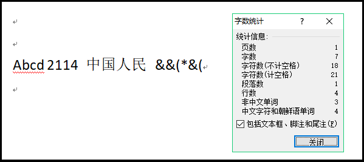
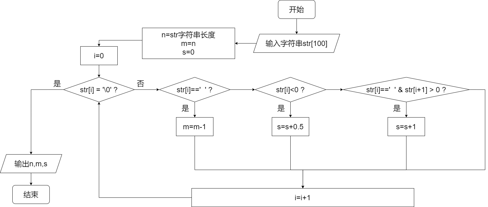
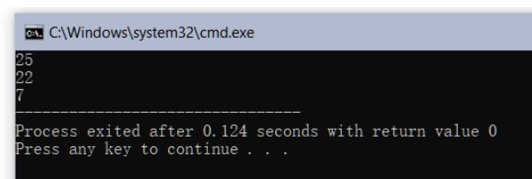

# 单科成绩统计

## 一、实验任务

请编写程序，参照word软件的字数统计功能，统计以下信息： 

1. 字符数（计空格，1个汉字按2个字符计算）；
2. 字符数（不计空格）；
3. 字数（1个汉字按1个字计数；连续非汉字字符按1个字计数，以空格为分割）。

图1. Word字数统计示例



## 二、实验设计  

1、流程图  
（可纸上画好，截图片）



（大图随附件上传）

2、程序代码  
（源代码）

```c
#include<stdio.h>
#include<string.h>

float s = 1;
int n, m;

int main() {
    char str[100];
    gets(str);

    n = strlen(str);
    m = n;

    for (int i = 0;; i++) {
        if (str[i] == ' ') m--;
        if (str[i] == ' ' && str[i + 1] > 0) s++;
        if (str[i] < 0) s += 0.5f;
        if (str[i] == '\0') break;
    }
    printf("%d\n%d\n%.0f", n, m, s);
    return 0;
}
```

## 三、运行测试

1. 测试案例：`str[]="Abcd  2114  中国人民  &&( *&(";`  
2. 运行结果（请截图）  



## 四、实验总结

### 1、程序编译时产生的错误及改正方法

//按下编译按钮后，程序出现的错误信息及相应修正方法

**（1）错误：行s=s+0.5无法通过编译。**

原因：记录字数时没有考虑是否为整形。

改正方法：变量s使用float定义，而非int。

### 2、程序运行结果不正确情况及改正方法  

//按下运行按钮后，出现的不正确的结果信息及相应修正方法

**（1）错误：无法统计英文单词。**

原因：在对字符逐个遍历时，错误给第二个if前加了else。

改正方法：去掉不应该加的else。

