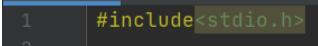
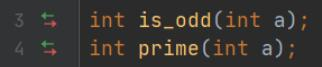
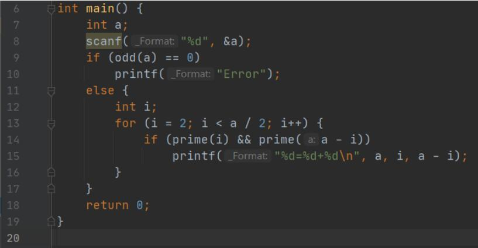
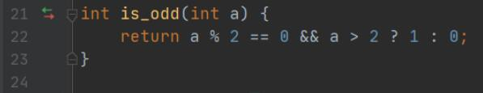
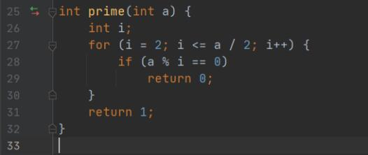
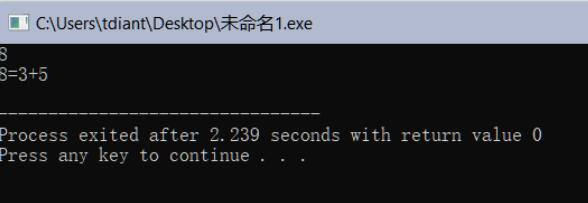
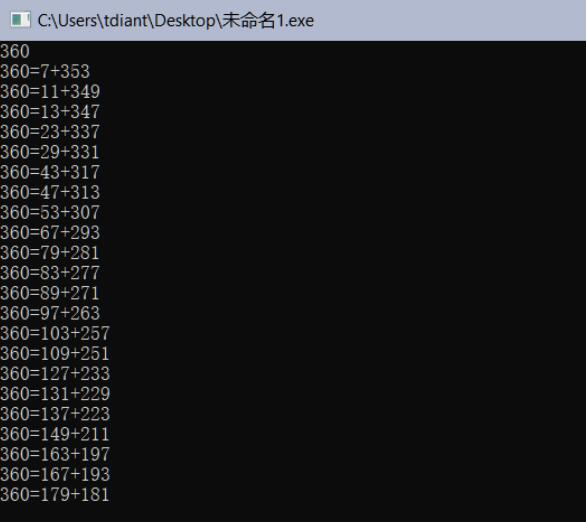
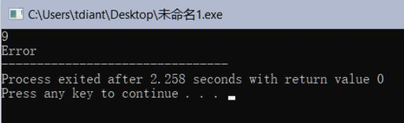
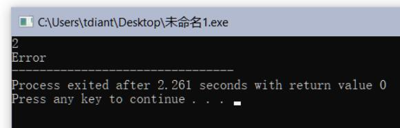

# 哥德巴赫猜想

## 一、实验任务

请综合运用函数、循环、分支等知识，编写程序检验Goldbach猜想：

哥德巴赫猜想：任一大于2的偶数都可写成两个素数之和。

1. 请设计奇偶性判定函数；
2. 请设计素数判定函数； 
3. 主函数要求：输入任意一个正整数x，若为大于2的偶数，请输出符合猜想的两个素数；若不是大于2的偶数，则输出“Error”。

## 二、实验设计

1、函数设计  
（若该函数无参数或无返回值，请填写“无”）

**（1）奇偶判定函数**

函数原型：`int is_odd(int x)`  
功能说明：检测一个整数是否为奇数。  
参数说明：x：要判定奇偶性的整数。  
返回值说明：1表示x是奇数， 0表示x是偶数。  

**（2）素数判定函数**

函数原型：`int prime (int a)`  
功能说明：判断是否为素数  
参数说明：返回1代表a为素数，返回0代表a为合数
返回值说明：无  

**（3）主函数函数**

函数原型：`int main(void)`  
功能说明：实现程序的输入和输出功能，调度其他函数  
参数说明：定义a  
返回值说明：返回0代表程序正常结束  

2、程序代码  
（按函数截图）

预处理指令

函数声明

函数`int main(void)`

函数`int is_odd(int a)`

函数`int prime(int a)`

## 三、运行测试

1、测试案例：8  
运行结果（请截图）

2、测试案例：360  
运行结果（请截图）

3、测试案例：9
运行结果（请截图）

4、测试案例：2
运行结果（请截图）

## 四、实验总结

### 1、程序编译时产生的错误及改正方法

//按下编译按钮后，程序出现的错误信息及相应修正方法

**（1）错误：提示stray '\273' in program。**

原因：错误的将英文半角分号输入为英文全角分号。

改正方法：将全角分号改成半角分号。

**（2）错误：提示'is_odd' was not declared in this scope。**

原因：在main函数之前没有给定义的函数声明。

改正方法：在main函数前加入函数声明语句。

### 2、程序运行结果不正确情况及改正方法

//按下运行按钮后，出现的不正确的结果信息及相应修正
方法

**（1）错误：多组结果都挤在一行。**

原因：printf格式控制字符串没有在结尾加入\n。

改正方法：补充上遗漏的\n。
