# 成绩分析系统

## 一、实验任务

请综合运用函数、循环、数组等知识，根据湖南理工学院学生成绩分析的需求（见表1和表2），设计和实现一个成绩分析系统：

1. 数据的定义；
2. 函数原型的设计； 
3. 各个函数的实现；
4. 主函数的设计与实现。

注：平时、实验、期考成绩可以随机生成（分数范围：50-99之间）。

表1. 成绩登记表  
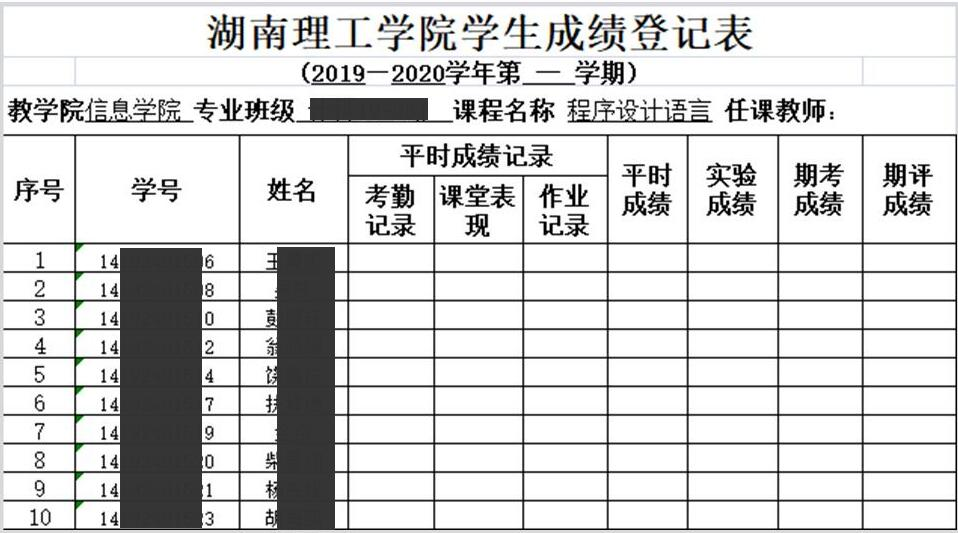

表2. 成绩分布表  
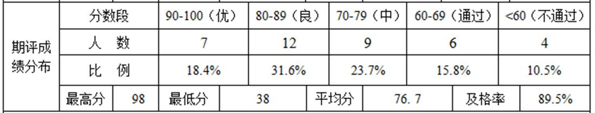


二、实验设计  

1、数据定义

（1）主要的全局变量

```c
int a[38][4] = {0};
int n = 38; //表示人数，总计38人（由上图7+12+9+6+4得出）
```


（2）主要的局部变量

```c
int b[10] = {0};
int t;
int ma;
int mi;
```

2、函数设计

2.1 函数调用关系图

（可手写拍照）

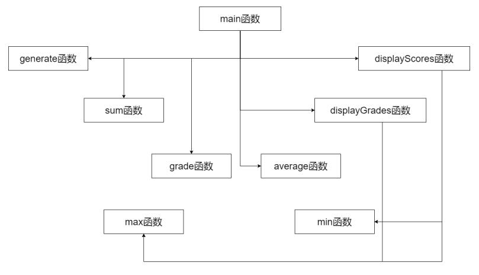


2.2 函数设计说明

**（1）主函数**

函数原型：`int main()  `
功能说明：程序入口函数，调用各个函数。  
参数说明：无  
返回值说明：0代表程序正常运行并正常退出。  

**（2）成绩生成函数**
函数原型：`void generate()`  
功能说明：生成随机成绩数据  
参数说明：无  
返回值说明：无  

**（3）成绩显示函数**

函数原型：`void displayScores()`  
功能说明：输出所有保存的成绩数据  
参数说明：无  
返回值说明：无  

**（4）分数段计算函数**

函数原型：`void grade(int b[])`
功能说明：计算并统计各个分数段的相关数据
参数说明：`int b[]`：成绩数据数组，即所需处理的数据源  
返回值说明：无

**（5）最大值函数**

函数原型：`int max()`  
功能说明：求取最大成绩  
参数说明：无  
返回值说明：返回int类型的最大成绩数值  

**（6）最小值函数**

函数原型：`int min()`  
功能说明：求取最小成绩  
参数说明：无  
返回值说明：返回int类型的最小成绩数值  

**（7）平均值函数**  

函数原型：`double average()`  
功能说明：求取平均值  
参数说明：无  
返回值说明：返回double类型的平均值数值  

**（8）分数段显示函数**  

函数原型：`void displayGrades(int b[])`  
功能说明：输出各分数段数据  
参数说明：`int b[]`：学生成绩数组，即所计算的数据源  
返回值说明：无  

2、程序代码  
（按函数截图）

预处理指令

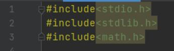

全局变量

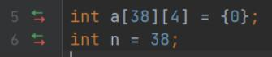

sum函数

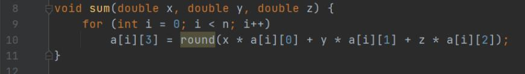

generate函数

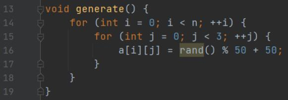

displayScores函数

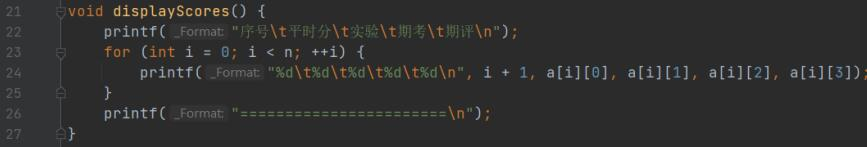

grade函数

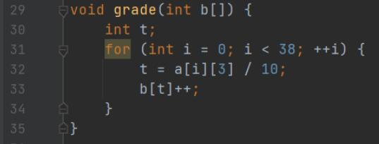

max函数

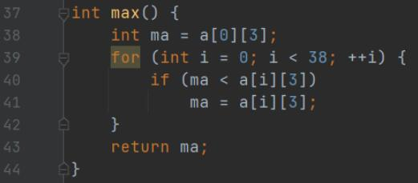

min函数

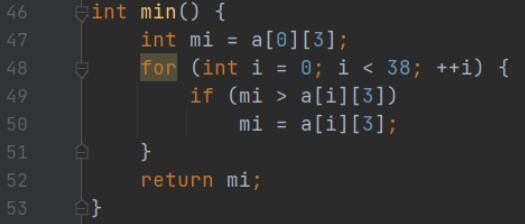

average函数

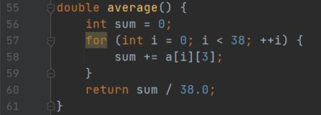

displayGrades函数

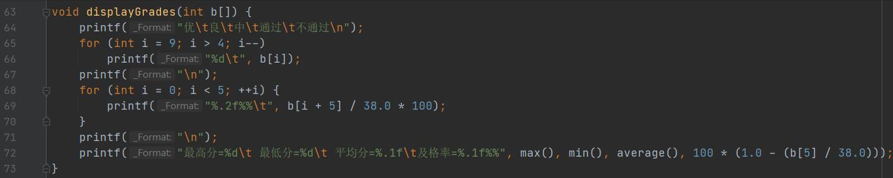

main函数

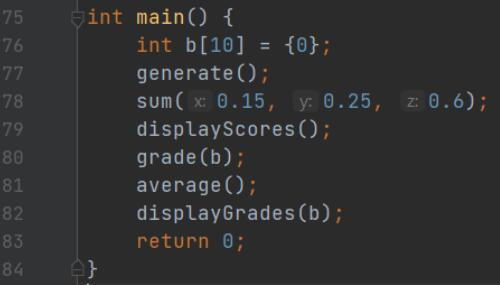


## 三、运行测试

### 1、显示成绩表

（包括表1中平时、实验、期考、期评4项内容，其中平时占15%，实验占25%，期考占60%）

运行结果（请截图）

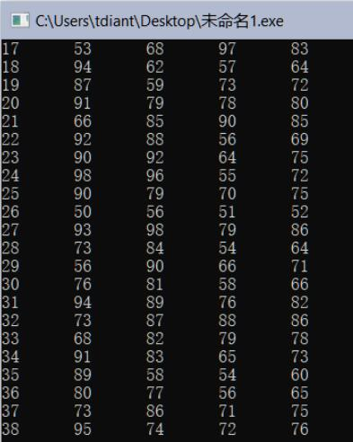


### 2、显示统计表

（包括表2中所有内容）

运行结果（请截图）

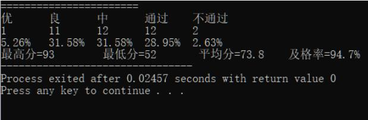

## 四、实验总结

### 1、程序编译时产生的错误及改正方法

//按下编译按钮后，程序出现的错误信息及相应修正方法

无


### 2、程序运行结果不正确情况及改正方法  

//按下运行按钮后，出现的不正确的结果信息及相应修正方法

无

