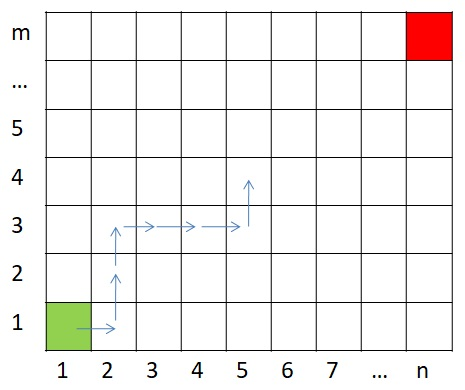
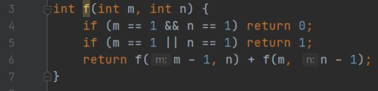
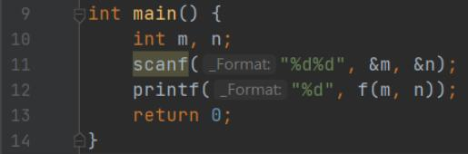
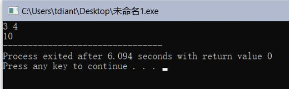
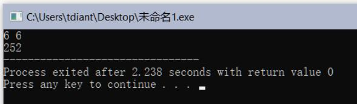

# 棋盘问题的递归设计

## 一、实验任务

如图所示，给定一个mn的棋盘，从左下角（1, 1）走到右上角（m, n），每次只能向上或者向右走一格，请问有多少种走法？

1. 请设计递归函数f（m, n），计算从（1, 1）到（m, n）不同走法的数目。
2. 拓展选做：试着把所有的走法列出来。每种走法可按单元格的顺序排列，例如：在m=3，n=4的棋盘中，(1,1)(1,2)(2,2)(2,3)(3,3)(3,4)是一种走法。

## 二、实验设计

1、递归函数设计

（1）递归函数`f(m, n)`
函数原型：`int f（m, n`  
功能说明：求解所有解的个数  
参数说明： m 行数； n 列数  
返回值说明： 返回解的个数  

（2）递推式设计 

（设计递推公式，将较大问题转化为较小的同类子问题）
递归式：

`f(m,n) = f(m - 1, n) + f(m, n - 1)` (m≠1且n≠1)    
`f(m,n) = 1`（m=1或m=1）   
`f(m,n) = 0` （m=1且n=1） 

（3）递归出口设置  
（设置原子问题的解）

当m与n同时为1时，返回0；当m与n有且仅有一个为1时，返回1。

2、程序代码  
（按函数截图）

预处理指令

函数f

函数main

## 三、运行测试

1、测试案例：m=3，n=4  
运行结果（请截图）

2、测试案例：m=6，n=6  
运行结果（请截图）

## 四、实验总结

### 1、程序编译时产生的错误及改正方法

//按下编译按钮后，程序出现的错误信息及相应修正方法

无

### 2、程序运行结果不正确情况及改正方法

//按下运行按钮后，出现的不正确的结果信息及相应修正方法

**（1）错误：程序一直运行，无法输出计算结果。**  

原因：没有在f函数中写递归出口，递归无法跳出。

改正方法：补充递归出口。
