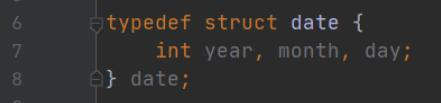
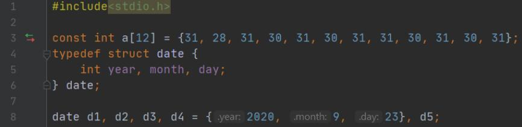
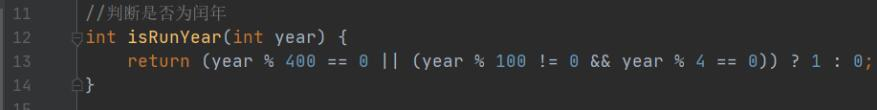
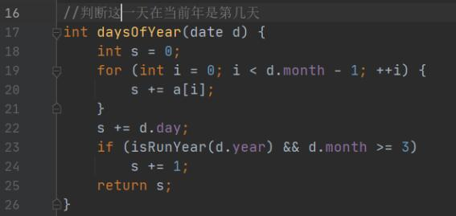
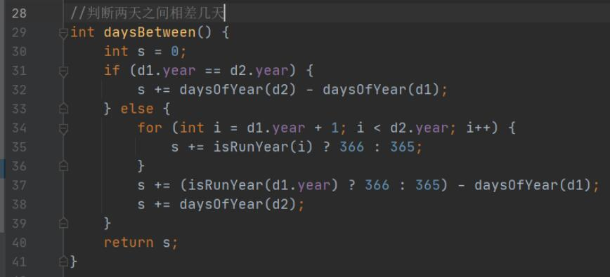
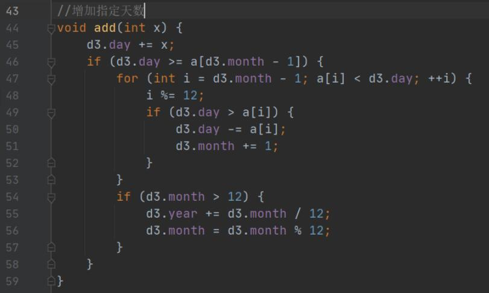
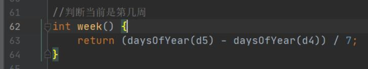
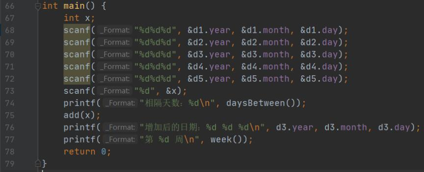
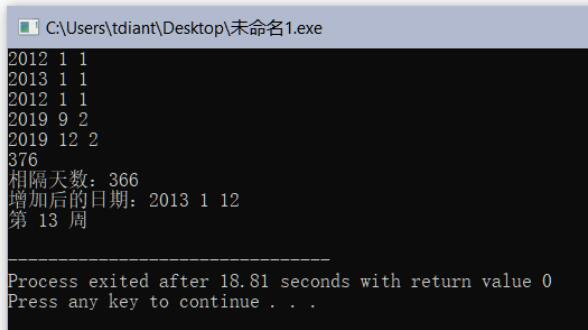
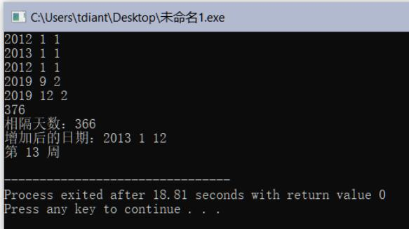

# 日期计算

## 一、实验任务

综合运用结构体、函数等知识，完成下面实验任务：

1. 任意给定两个日期d1和d2，请计算d2-d1日期之差；
2. 给定一个日期d1，计算x天之后的日期d2；
3. 给定本学期开学日期d，计算今天是本学期第几周。

## 二、实验设计

1、结构体设计

2、函数设计

**（1）函数：**  

函数原型：`int isRunYear(int year)`  
功能说明：判断是否为闰年  
参数说明：year：需要判断的年份  
返回值说明：1为闰年，0为平年  

**（2）函数：**

函数原型： `int daysOfYear(date d)`  
功能说明：判断这一天在当前年是第几天  
参数说明：给定一个日期  
返回值说明：返回所求天数  

**（3）函数：**

函数原型：`int daysBetween()`
功能说明：求两日期之差
参数说明：无
返回值说明：两个日期相隔的天数

**（4）函数：**

函数原型：`void add(int x)`
功能说明：为指定日期增加指定的天数 
参数说明：增加的天数
返回值说明：无

**（5）函数：**

函数原型：`int week()`
功能说明：计算当前为第几周
参数说明：无
返回值说明：返回当前周数

2、程序代码  
（按函数截图）

预处理指令与全局变量部分

isRunYear函数  判断是否为闰年

daysOfYear函数  判断这一天在当前年是第几天

daysBetween函数  判断两天之间相差几天

add函数  增加指定的天数

week函数  判断当前是第几周

main函数

## 三、运行测试

1、测试案例：`d1=2012-1-1，d2=2013-1-1`  
运行结果（请截图）

（为了使结果更合理，假设今天的日期为2019年12月2日）

2、测试案例：`d1=2012-1-1，x=376`  
运行结果（请截图）

（为了使结果更合理，假设今天的日期为2019年12月2日）

3、测试案例：`d=2019-9-2`  
运行结果（请截图）

（为了使结果更合理，假设今天的日期为2019年12月2日）

## 四、实验总结

### 1、程序编译时产生的错误及改正方法

//按下编译按钮后，程序出现的错误信息及相应修正方法

**（1）错误：编译器提示Use of undeclared identifier “isRunYear”**  

原因：没有在main方法前声明isRunYear函数。

改正方法：在main函数前声明isRunYear函数。

### 2、程序运行结果不正确情况及改正方法

//按下运行按钮后，出现的不正确的结果信息及相应修正方法

**（1）错误：daysBetween计算跨年日期错误**  

原因：没有考虑到跨年日期的日期进位问题

改正方法：补充对跨年日期的进位处理。

**（2）错误：add计算跨出本年份天数时无法正确计算**  

原因：没有考虑到跨年、跨月日期的日期进位问题

改正方法：补充对跨年、跨月日期的进位处理。
